# Task 2.1
## Part1
1. Today, the most popular hypervisors for infrastructure virtualization are: VMware; Hyper-V; Xen; KVM; OracleVM VirtualBox.  
2. These hypervisors are divide depending on the way of virtualization (Virtualization types).
**First** type works in the way guest machine is running as a regular machine. It means that virtual machine "thinks" that it works on a real hardware with no virtualization layer. There are no changes in OS of such machines. In this case we can even install drivers for devices.  
**Second type** is Hypervisors which are installed on host OS. Virtual machines are configured and running from Hypervisor environment which is usually goes as installed application on host computer.  
Other two Hypervisors are **Monolithic** and **Microkernel** ones.  
**Monolithic** goes from its name: We have some hardware, the Hypervisor is connected to it, it manages all required transactions between hardware and virtual machines. Every software required for virtual machine work is located and managed in Hypervisor. Hypervisor is also  responsible for device drivers for virtual machines.
**Microkernel** - Hypervisor manages providing hardware resources to virtual machines. However, in this case Hypervisor is also running as a virtual machine which is called *parent*.

## Part2. Work with VirtualBox
1. I have already been using VirtualBox. I have decided to use previously downloaded *ubuntu-18.04.2-desktop-amd64* for this practice.  
Created **Ubuntu** VM:  
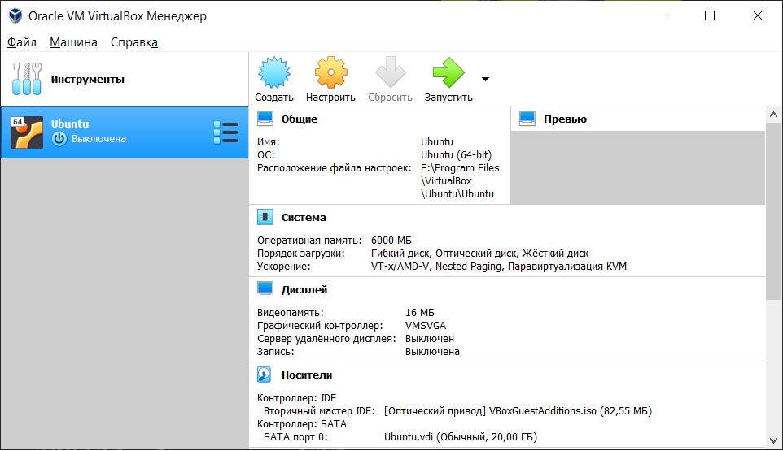  
After passing basic *Ubuntu* installation steps, the VM runs:  
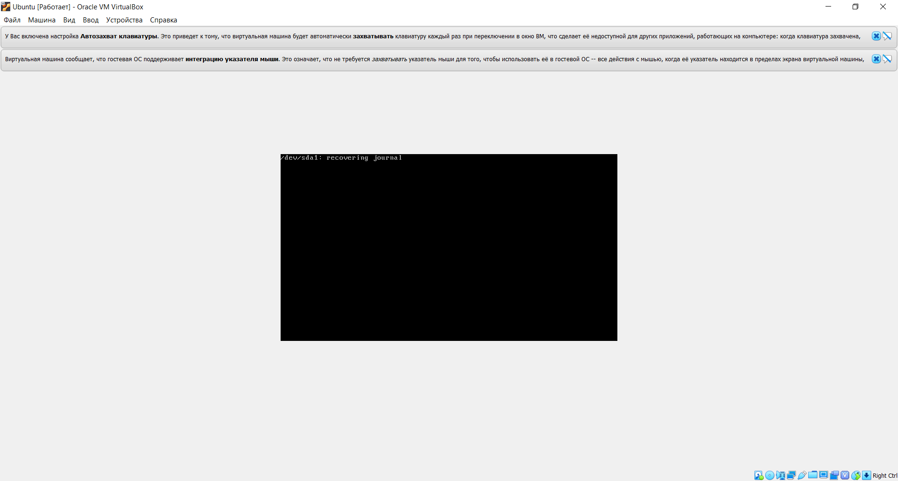  
VirtualBox allows to quickly manage state of VM. I have tested:  
*Start/Stop* - power on/off the machine;  
*Reboot* - Restart the machine;  
*Save state* - allows to freeze your machine and close its window. When machine is up, it starts right from the same moment/state;  
*Pause* - allows to freeze running machine without closing its window.  
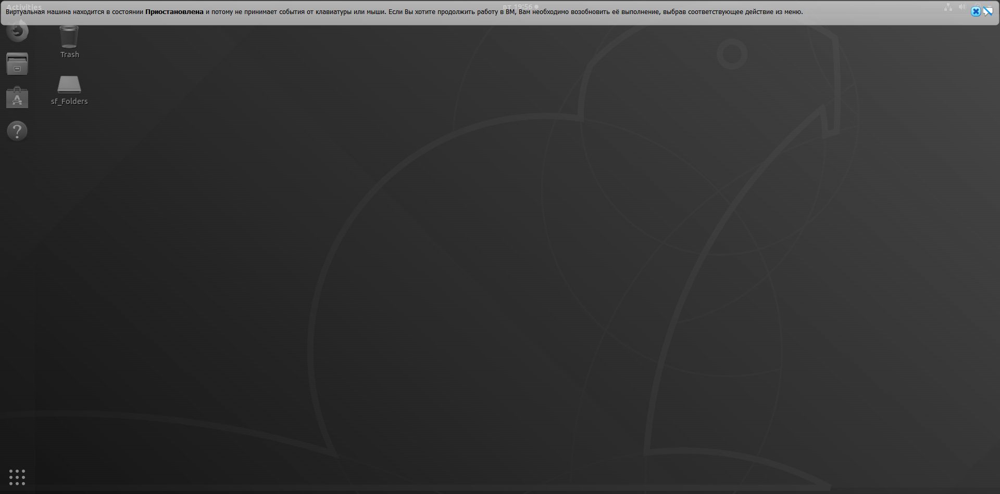
I have also created another machine called **VM1**. It was cloned as **VM2**:  
  
After that, both machines were **grouped** with drag`n`drop option in VirtualBox GUI:  
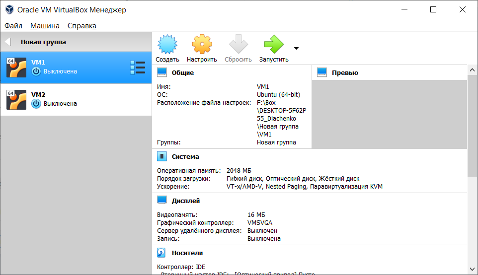  
When your machines are grouped, you can apply the same settings for them. You can also start all the machines in group.  
Taking **snapshots** allows you to capture current state of the machine. After that, you can restore this state.  
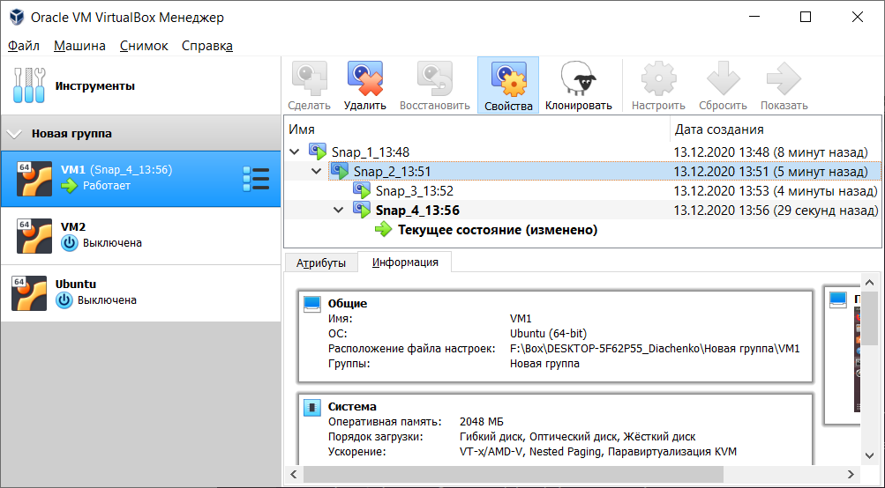  
**Exporting VM** allows to export machine into a file. This file could than be restored in VirtualBox on other computers.
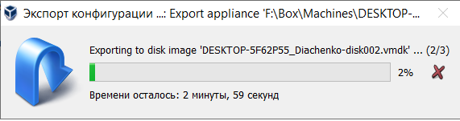  
2. VM configurations allow you to change settings which basically configure virtual hardware for machines.  
When **USB device** is plugged in host machine, you just need to locate USB options in guest machine interface-window and select required USB socket you wish to use with guest machine.  
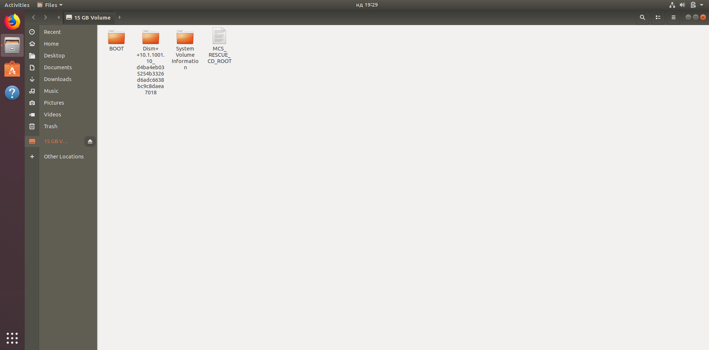  
**Shared folders** option will allow to share specific folder on host machine to a guest machine. Such adjustments requires **guest additions** to be installed.  
However, installing guest additions may not be enough in some cases. By default shared folders have an owner **vboxsf** which prevents from accessing shared folder to a non-root user.  
You can add current guest machine use to **vboxsf** group. After that, it may be required to mount new *device* to a mount point.  
`sudo adduser vlad vboxsf  
vlad@DESKTOP-Diachenko:~$ mkdir folder  
vlad@DESKTOP-Diachenko:~$ sudo mount -t vboxsf -o uid=1000,gid=1000 share ~/folder`  
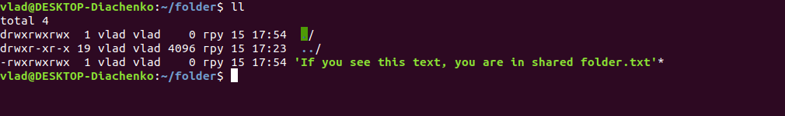
VirtualBox provides several **network modes** which allow flexible configuration depending on the network access you need.  
**NAT Service** is set by default and it allows guest machines to use host network for Internet access.  
**NAT network** works in similar way. However, it is required to configure network which will be used by guest machines.  
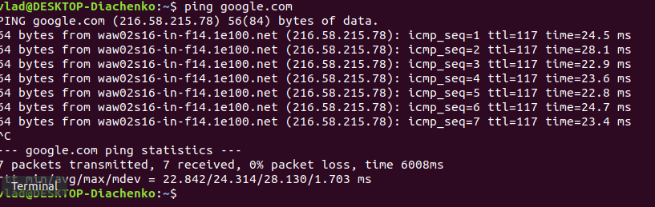  
It also allows guest machines in the same network to communicate with each other. Here *nmap* tool has located another device in the same network.  
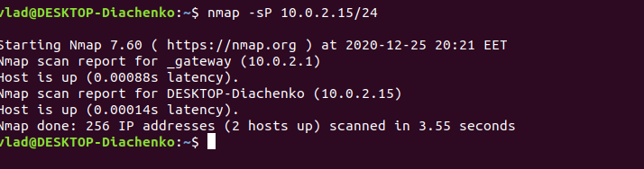  
A connection between host and guest machine in NAT network is possible with **port forwarding**.  
  
**Host-only network** allows to create internal network which allows communication between host and guest machines without Internet access for guest.  
It was not working the way it should for the first time. The issue was fixed by disabling **Windows brandmauer**  
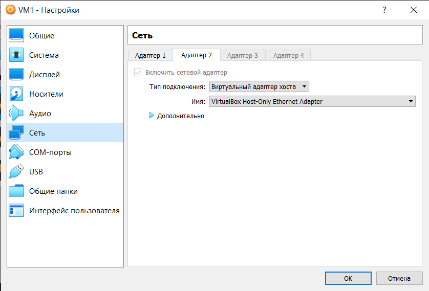  
We see that this netwok is being created as a virtual one:  
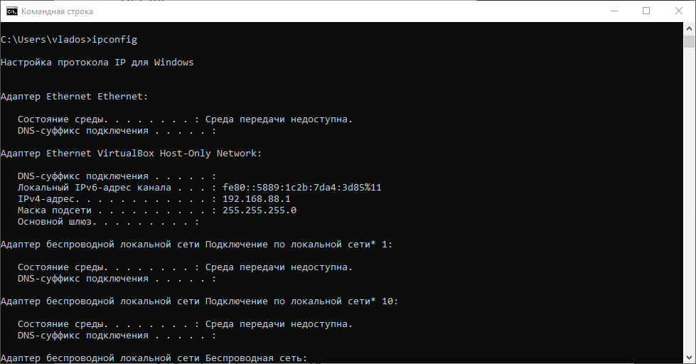  
Guest machines communicating with host:  
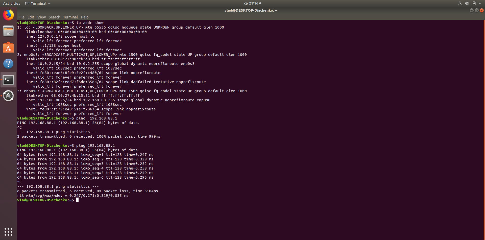  
**Bridget network** creates internal network between guest and host machines. It also allows guest machines to use host network for internet access.  
Guest machines can communicate with each other.  
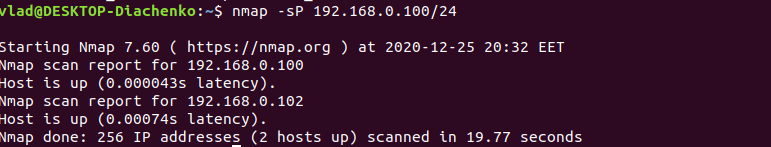  
Host machine is able to communicate with guest:  
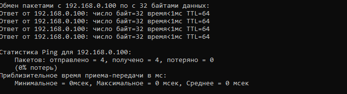  
Internet access is also available  
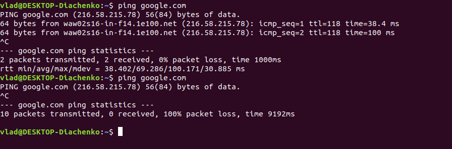  
**Internal network** creates network similar to the one created by **Bridged mode**. However, it does not allow internet access for guest machines.  
It may also require to create DHCP server in order to assign IPs to guest machines.  
`./vboxmanage dhcpserver add -netname test -ip 10.10.10.1 -netmask 255.255.255.0 -lowerip 10.10.10.2 -upperip 10.10.10.100 -enable`  
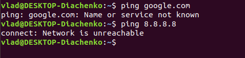  
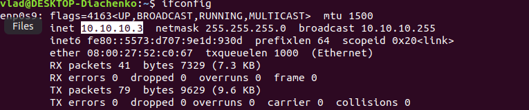  
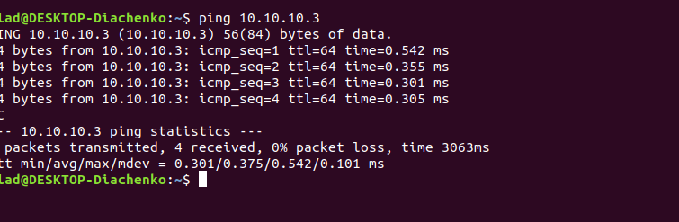  
To sum up:  
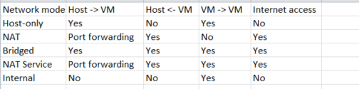  
3. Usage of *vboxmanage* command to control VirtualBox machines is possible in case you have accessed the same folder where VirtualBox is installed.  
It should also be possible to add vboxmanage command into default *PATH* on Windows system.  
Examples of *vboxmanage* command usage:  
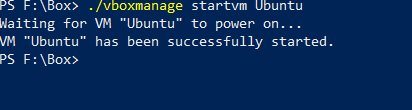  
  
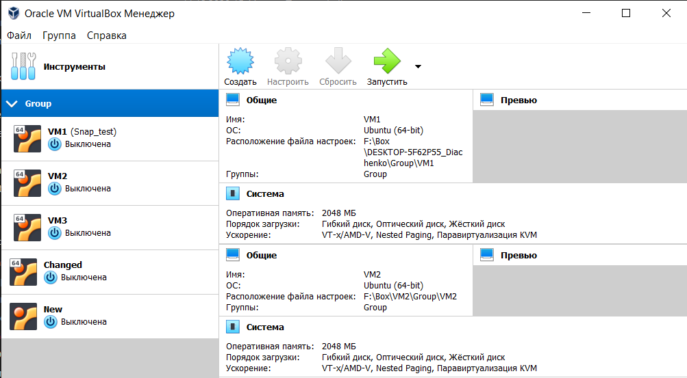  
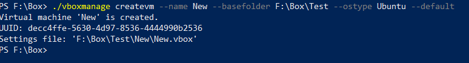  
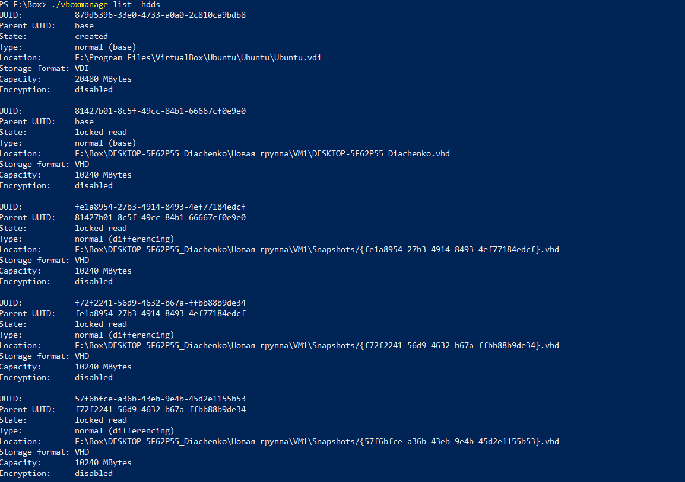  
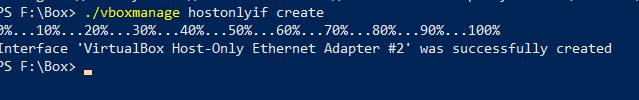  
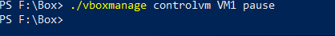  
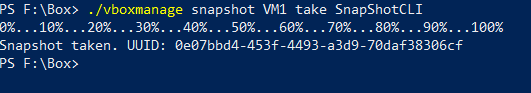  
#Part3. Work with Vagrant  
1. `vagrant init hashicorp/precise64` command creates Vagrantfile with *hashicorp/precise64* box set as a base box for instance.
If this box is not located in Vagrant's cache, it will download it from Vagrant cloud.  
2. `vagrant up` will activate instance based on selected box. It will forward port 22 to 2222 and create *vagrant* user with sudo privileges  
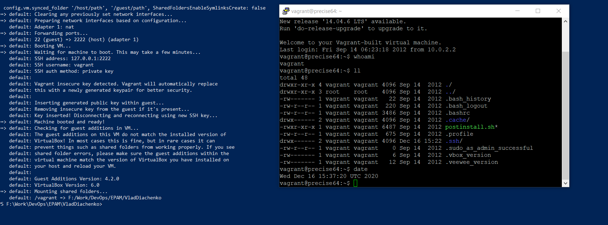  
3. `vagrant halt` will power off running machine.  
`vagrant destroy` will remove created machine.  
4. Vagrant box could be created from a running Vagrant machine.  
You can specify another Vagrantfile for your box for additional settings.  
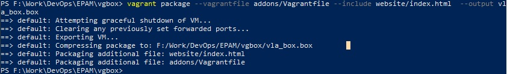  
I have created box based on **bento/ubuntu** box. In Vagrantfile I have set shell provisioner which executes [bash script](.Vagrant/provisioners/apacheinst.sh)  
This script installs Apache web-server on machine. It also moves index.html file in order to show it in browser.  I have used additional Vagrantfile which creates port-forwarding of 80's ports. In this way, it will be possible to check website on *localhost*.  
[Vagrantfile](./Vagrant/Vagrantfile)  
[im](./Screenshots/vagrantinit.png)  
5. I thought that deadline for tasks are set to the end of December (27-30). So, I have not created vagrant box with several machines running in the same network.  
It will be created and added to this repository soon.  
