# Task 2.2
1. Launching VM with Amazon Lightsail.  
Lightsail is a service which allows to quickly run instance without any deep-long configuration.  
It is useful for some basic applications and in case you do not need complex configuration. It is also has some pre-sets with pre-installed software e.g. WordPress.  
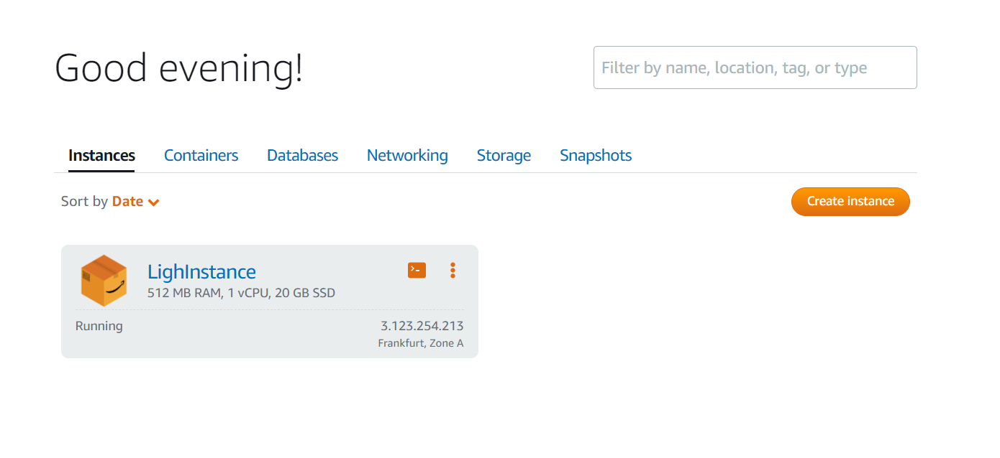  
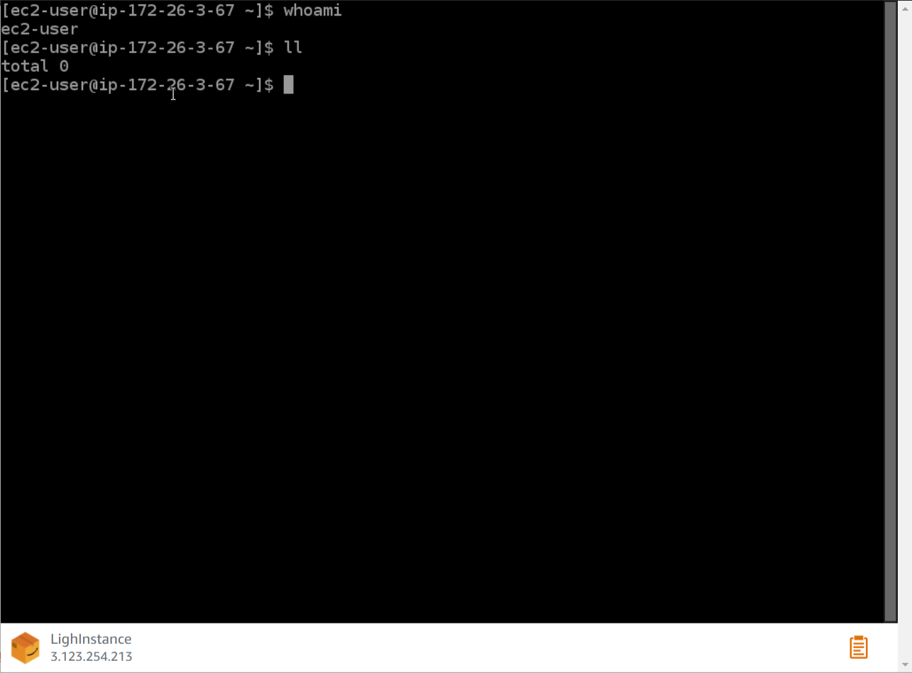  
2. Launching instance using EC2 service allows much more configuration options.  
I have decided to create my instance in Frankfurt Zone A pretending my users will be mostly from Europe.  
It was required to select **CentOS** image, it should be additionally located during image selection (First step). The best way to find CentOS is to check community images.  
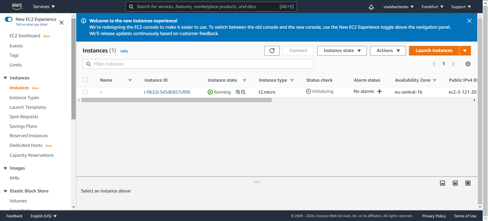  
AWS provides in-built console in order to connect to your instnces directly in your browser. It has other options for SSH connect which require additional settings.  
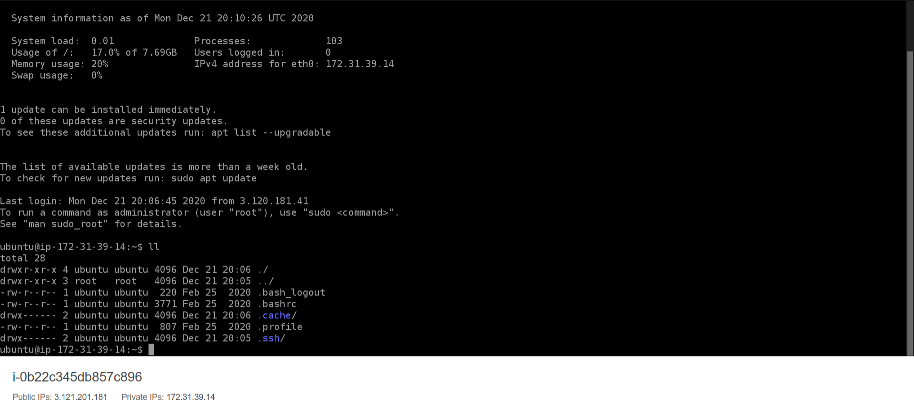  
3. Taking a snapshot.  
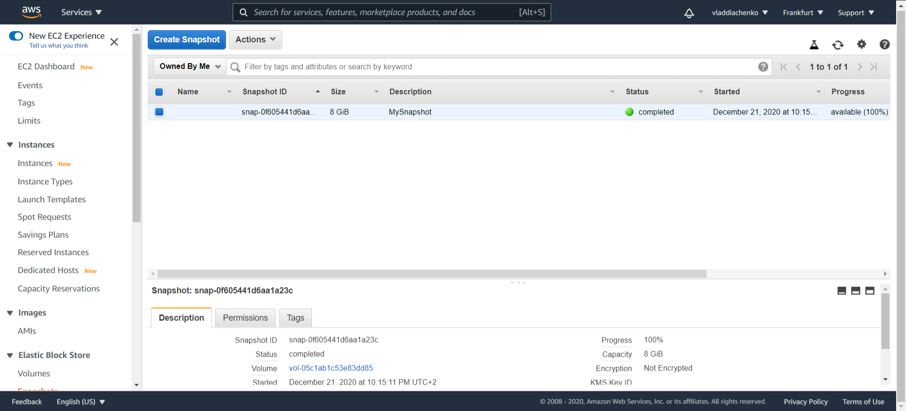  
4. It was required to create new volume in EBS and attach it to instance in order to increase disk space.  
During connection it was noticed that some OSes are renaming volume name inside system.  
Volume is being added as a block.  So it is required to create File System on it and mount the device.  
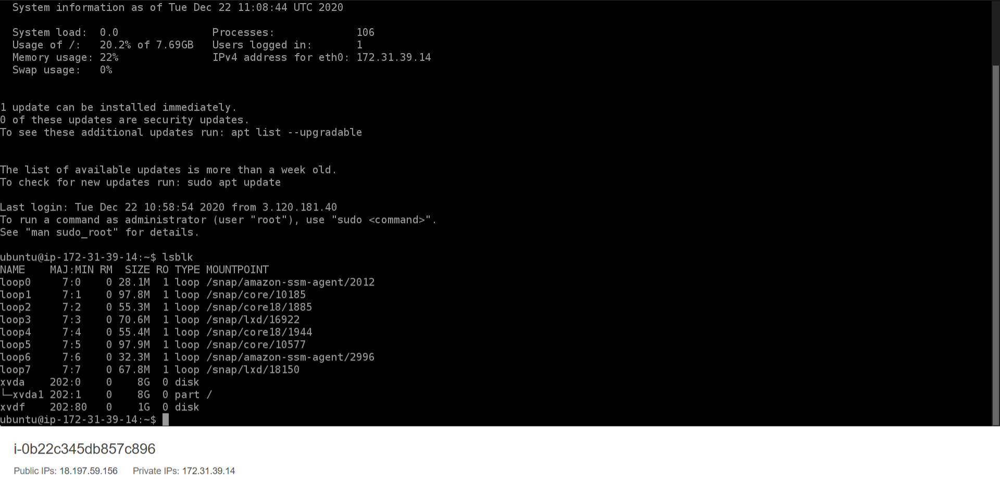  
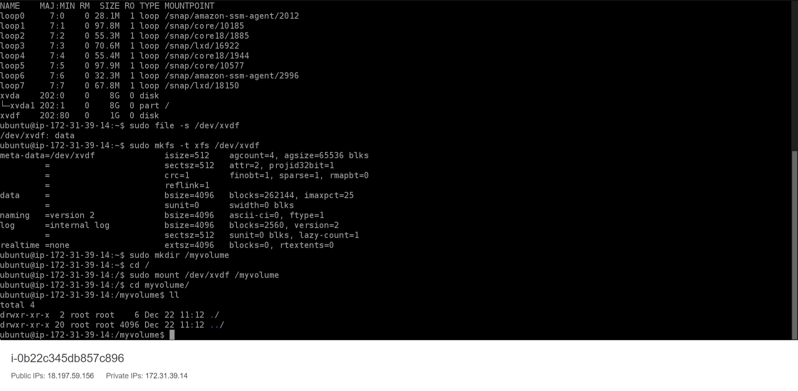  
5. Using previously-created snapshow, I have launched new instance.  
It was required to create image from that snapshot first.  
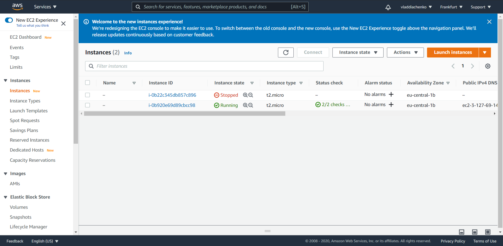  
6. Detaching previously created volume in order to attach it to newly created one.  
7. I have created instance with WordPress using **Lighsail** service.  
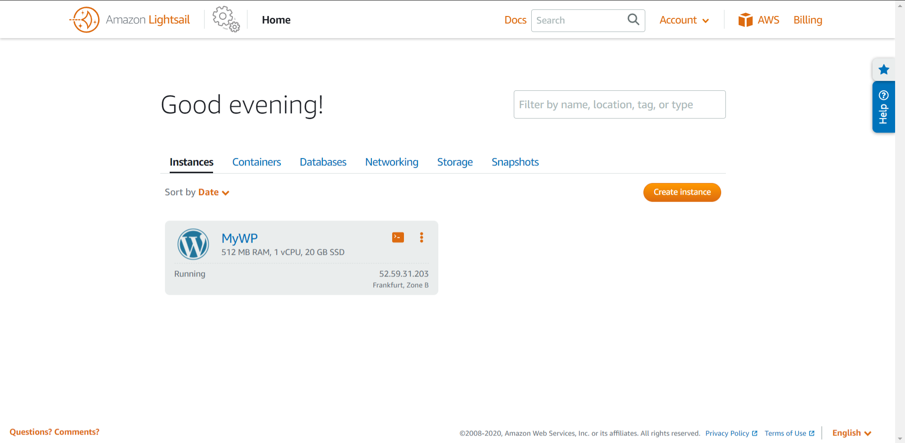  
8. Exploring S3 service to store data.  
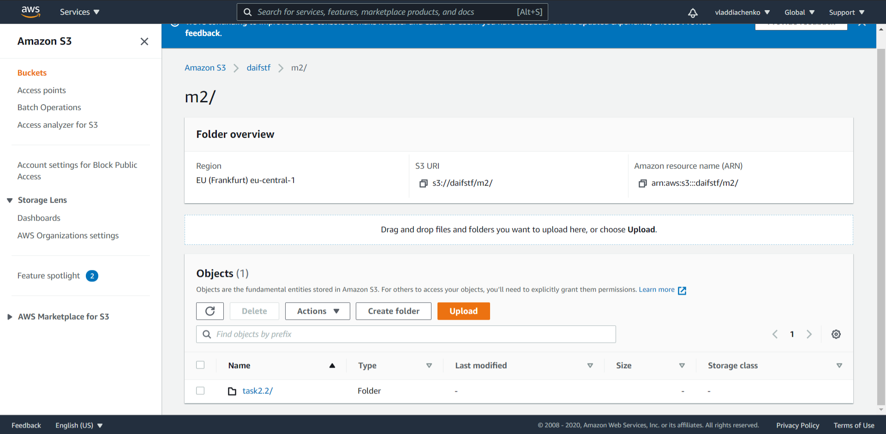  
9. Managing S3 storage via AWS CLI. Creating IAM user to access S3 from a CLI.    
`vlados@vlados-VirtualBox:~/awsinst$ aws s3 mb s3://vlados-buckett`  
`make_bucket: vlados-buckett`  

Uploading File  
`vlados@vlados-VirtualBox:~/awsinst$ aws s3 cp ./file.txt s3://vlados-buckett`  
`upload: ./file.txt to s3://vlados-buckett/file.txt  ``

Downloading file  
`aws s3 cp s3://vlados-buckett/file.txt ./aws`  
`download: s3://vlados-buckett/file.txt to aws/file.txt`           
`чт гру 24vlados@vlados-VirtualBox:~/awsinst$ cd aws`  
`чт гру 24vlados@vlados-VirtualBox:~/awsinst/aws$ ll | grep file.txt`  
`-rw-rw-r--  1 vlados vlados    12 гру 24 11:12 file.txt`  

Deleting file  
`aws s3 rm s3://vlados-buckett/file.txt`  
`delete: s3://vlados-buckett/file.txt`  
10. Deploying Container with Amazon ECS service.  
Using the Fargate launch type, you can run your containerized applications without the need to provision and manage the backend infrastructure. After you register your task definition, Fargate launches the container for you.

There is also **EC2** launch type which launches your Container on your EC2 instance.  
It is possible to launch several copies of application and activate load balancing - *ELB*  

We need to create IAM user for load balancer.    

Delete cluster with container which should be stopped. After that, you need to delete load balancer additionally
Load balancer was also deleted.  
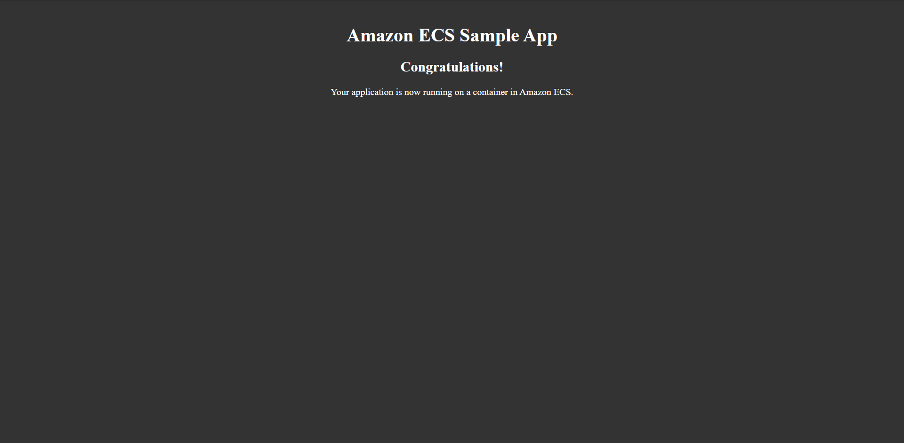  
Custom application in container will be launched soon. Unfortunately, I did not notice the deadline for this task. So I am going with basics for now.  
11. The last step is to create website using S3 storage.  
I have already registered a domain with another company. I will use it for this page.  
It was required to set ALIAS record to DNS settings of my domain.  
The website works after allowing public access.  
[link](http://stealthninja.me)  
At the moment, it show show 403 error as I have disabled public access to my bucket. Free-tier bucket is limited to storage and number of accesses to objects.  
It was decided to left it without access in order not to waste resources. Please let me know if you wish to check it and I will remove restrictions.  
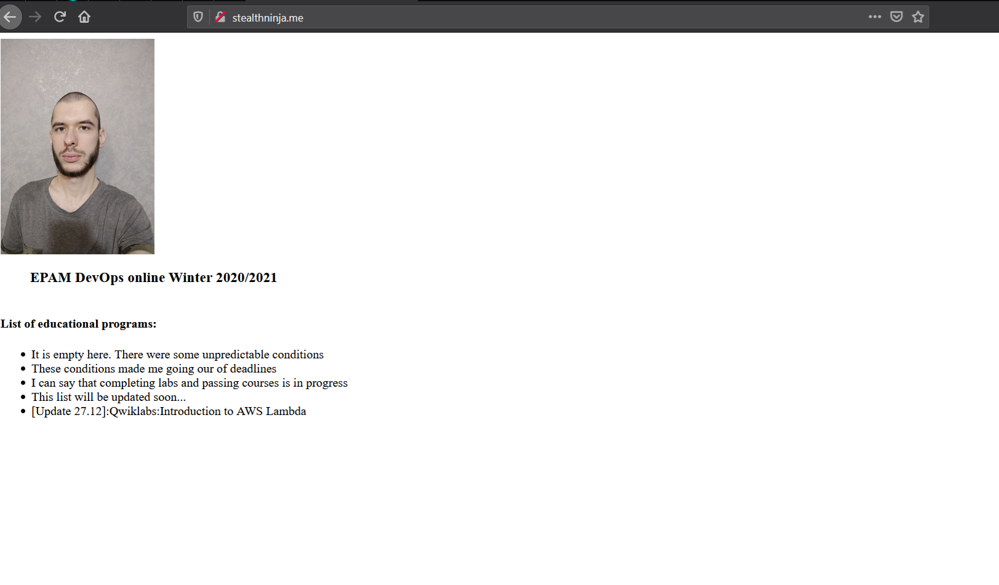  
