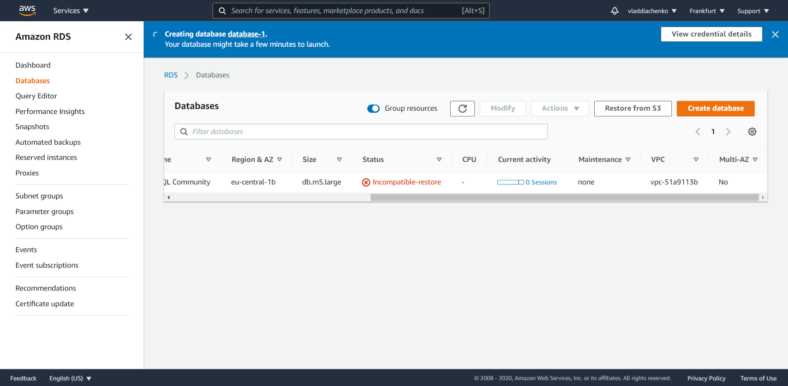
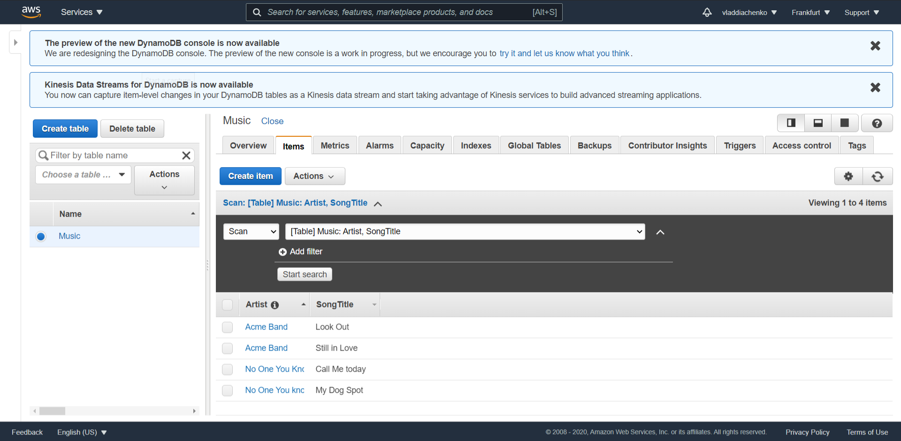
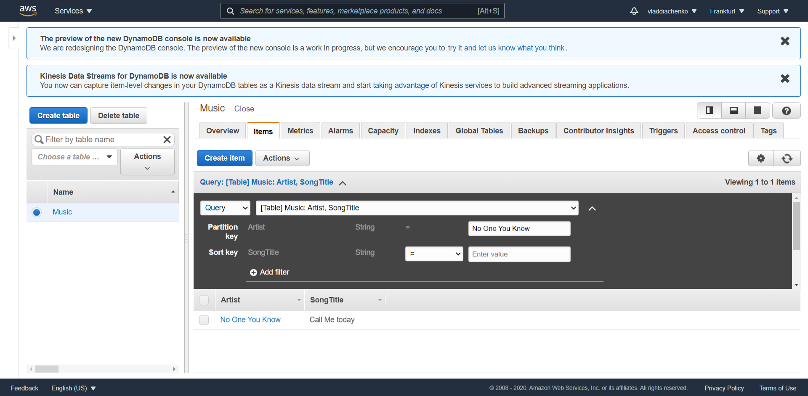
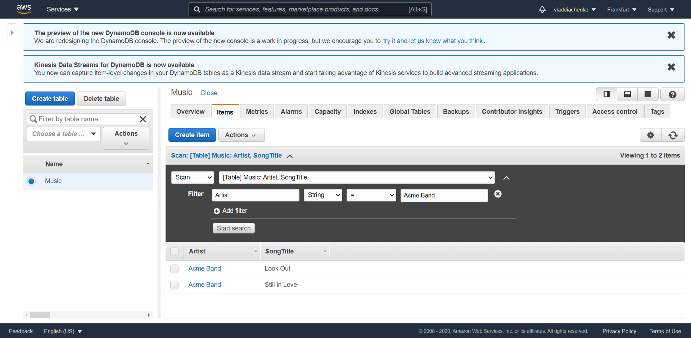

# Task 3.1
## Part 1
1. I have installed **MySQL-server** using *apt-get* on my Ubuntu VM.  
2. My database is an Academy list. It has 3 tables: *Students*, *Teachers*, and *Subjects*.  
3. Creating a database **db_Academy**:
`mysql> CREATE DATABASE db_Academy ;`  
`mysql> show databases ;``
`+--------------------+  
| Database           |  
+--------------------+  
| information_schema |  
| db_Academy         |  
| mysql              |  
| performance_schema |  
| sys                |  
+--------------------+  
5 rows in set (0.00 sec)`  
4. Creating database tables:  
`mysql> CREATE TABLE db_Academy.students (ID INT, Name TEXT, Surname TEXT, Status BOOL) ;`  
`Query OK, 0 rows affected (2.23 sec)`  
5. Filling tables:  
`INSERT INTO db_Academy.students(ID, Name, Surname, Status) VALUES (0, 'Vitaliy', 'Kartoshka', 1), (1, 'Vlad', 'Ogorodnik', 1), (2, 'Dima', 'Sokolov', 0);`  
`Query OK, 3 rows affected (0.00 sec)`  
`SELECT * FROM db_Academy.students ;`  
`+------+---------+-----------+--------+`  
`| ID   | Name    | Surname   | Status |  
+------+---------+-----------+--------+  
|    0 | Vitaliy | Kartoshka |      1 |  
|    1 | Vlad    | Ogorodnik |      1 |  
|    2 | Dima    | Sokolov   |      0 |  
+------+---------+-----------+--------+  
3 rows in set (0.00 sec)`  
6. Using SELECT operator queries:  
`SELECT * FROM db_Academy.students WHERE Status = 1 ORDER BY Surname DESC ;`  
`+------+---------+-----------+--------+  
| ID   | Name    | Surname   | Status |  
+------+---------+-----------+--------+  
|    1 | Vlad    | Ogorodnik |      1 |  
|    0 | Vitaliy | Kartoshka |      1 |  
+------+---------+-----------+--------+  
2 rows in set (0.00 sec)`  

`mysql> SELECT * FROM db_Academy.subjects WHERE AvGrade > 4 ;`  
`+------+------------+---------+  
| ID   | Name       | AvGrade |  
+------+------------+---------+  
|    2 | Politology |       5 |  
+------+------------+---------+`  
I have added new sudent into table before the following query:  
`mysql> INSERT INTO db_Academy.students(ID, Name, Surname, Status)`  
`-> VALUES (3, 'Serhii', 'Matroskin', 1);`  
`mysql> SELECT Surname, Name, Status FROM db_Academy.students WHERE status = 1 ORDER BY Name ;`  
`+-----------+---------+--------+  
| Surname   | Name    | Status |  
+-----------+---------+--------+  
| Matroskin | Serhii  |      1 |  
| Kartoshka | Vitaliy |      1 |  
| Ogorodnik | Vlad    |      1 |  
+-----------+---------+--------+`  
7. Executing DDL, DML, and DCL queries:  
`mysql> ALTER TABLE db_Academy.students ADD (Phone CHAR(15)) ;`  
`mysql> SELECT * FROM db_Academy.students ;`  
`+------+---------+-----------+--------+-------+  
| ID   | Name    | Surname   | Status | Phone |  
+------+---------+-----------+--------+-------+  
|    0 | Vitaliy | Kartoshka |      1 | NULL  |  
|    1 | Vlad    | Ogorodnik |      1 | NULL  |  
|    2 | Dima    | Sokolov   |      0 | NULL  |  
|    3 | Serhii  | Matroskin |      1 | NULL  |  
+------+---------+-----------+--------+-------+`  
**NULL** is shown as I have not filled any phone number.  
`mysql> ALTER TABLE db_Academy.students CHANGE Status Dismissed BOOL ;`  
`mysql> SELECT * FROM db_Academy.students ;`  
`+------+---------+-----------+-----------+-------+  
| ID   | Name    | Surname   | Dismissed | Phone |  
+------+---------+-----------+-----------+-------+  
|    0 | Vitaliy | Kartoshka |         1 | NULL  |  
|    1 | Vlad    | Ogorodnik |         1 | NULL  |  
|    2 | Dima    | Sokolov   |         0 | NULL  |  
|    3 | Serhii  | Matroskin |         1 | NULL  |  
+------+---------+-----------+-----------+-------+`  
`mysql> UPDATE db_Academy.students SET Dismissed = 0 WHERE Name = 'Serhii';`  
`mysql> SELECT * FROM db_Academy.students ;  
+------+---------+-----------+-----------+-------+  
| ID   | Name    | Surname   | Dismissed | Phone |  
+------+---------+-----------+-----------+-------+  
|    0 | Vitaliy | Kartoshka |         1 | NULL  |  
|    1 | Vlad    | Ogorodnik |         1 | NULL  |  
|    2 | Dima    | Sokolov   |         0 | NULL  |  
|    3 | Serhii  | Matroskin |         0 | NULL  |  
+------+---------+-----------+-----------+-------+`  
Before using **GRANT** command, it is required to create new database user.
`mysql> CREATE USER 'vlad_db' IDENTIFIED BY 'notactualpassword' ;`  
I have also created one user before for testing purposes:  
`SELECT user FROM mysql.user ;`  
`+------------------+  
| user             |  
+------------------+  
| databasegod      |  
| vlad_db          |  
| debian-sys-maint |  
| mysql.session    |  
| mysql.sys        |  
| root             |  
+------------------+`  
It is also possible to create user during privileges granting:  
`mysql> GRANT ALL PRIViLEGES on db_Academy.* TO 'databaseuser'@'localhost' IDENTIFIED BY 'WuyGkW#@' ;`  
 Removing ALL privileges from a user:  
 `REVOKE ALL PRIVILEGES ON db_Academy.* FROM 'databaseuser'@'localhost' ;`  
 8. Testing user privileges:  
 `mysql> CREATE TABLE user (ID INT PRIMARY KEY AUTO_INCREMENT, users TEXT);`  
 `mysql> SELECT * FROM user;  
+----+--------------+  
| ID | users        |  
+----+--------------+  
|  1 | databasegod  |  
|  2 | vlad_db      |  
|  3 | databaseuser |  
+----+--------------+`  
Giving user privilege to only use CREATE on all tables inside new_users database:  
`GRANT CREATE on new_users.* TO 'databasegod'@'localhost' IDENTIFIED BY 'WygWiE#%';`  
Giving user privileges to only use DROP on all tables inside new_users database:  
`mysql> GRANT DROP on new_users.* TO 'vlad_db'@'localhost' IDENTIFIED BY 'YgpW^@d';`  
Testing privileges:  
`mysql -u databasegod -p`  
`Enter password: `  
`mysql> use new_users`  
`DROP TABLE users ;`  
`ERROR 1142 (42000): DROP command denied to user 'databasegod'@'localhost' for table 'users'`  
`mysql> CREATE TABLE created (A INT, B INT, C INT);`  
`Query OK, 0 rows affected (3.02 sec)`  
Checking another user:  
`mysql> CREATE TABLE new_table (A INT, B INT, C INT);`  
`ERROR 1142 (42000): CREATE command denied to user 'vlad_db'@'localhost' for table 'new_table'`  
`DROP table created ;  
Query OK, 0 rows affected (0.01 sec)`
`SHOW GRANTS FOR 'vlad_db'@'localhost' ;  
+------------------------------------------------------+  
| Grants for vlad_db@localhost                         |  
+------------------------------------------------------+  
| GRANT USAGE ON *.* TO 'vlad_db'@'localhost'          |  
| GRANT DROP ON `user`.* TO 'vlad_db'@'localhost'      |  
| GRANT DROP ON `new_users`.* TO 'vlad_db'@'localhost' |  
+------------------------------------------------------+`  
From this table, we can see that user vlad_db has permissions to manage every database on server.  
Such permissions should be shared with caution. Removing these permissions:  
`mysql> REVOKE DROP ON user.* FROM 'vlad_db'@'localhost' ;`  
9. Running queries on main **mysql** database:  
`mysql> SHOW TABLES ;
+---------------------------+
| Tables_in_mysql           |
+---------------------------+
| columns_priv              |
| db                        |
| engine_cost               |
| event                     |
| func                      |
| general_log               |
| gtid_executed             |
| help_category             |
| help_keyword              |
| help_relation             |
| help_topic                |
| innodb_index_stats        |
| innodb_table_stats        |
| ndb_binlog_index          |
| plugin                    |
| proc                      |
| procs_priv                |
| proxies_priv              |
| server_cost               |
| servers                   |
| slave_master_info         |
| slave_relay_log_info      |
| slave_worker_info         |
| slow_log                  |
| tables_priv               |
| time_zone                 |
| time_zone_leap_second     |
| time_zone_name            |
| time_zone_transition      |
| time_zone_transition_type |
| user                      |
+---------------------------+
31 rows in set (0.00 sec)`  
`mysql> SELECT user from user ;
+------------------+
| user             |
+------------------+
| databasegod      |
| vlad_db          |
| databasegod      |
| databaseuser     |
| debian-sys-maint |
| mysql.session    |
| mysql.sys        |
| root             |
| vlad_db          |
+------------------+`  
`mysql> SELECT * FROM db ;
+-----------+--------------------+---------------+-------------+-------------+-------------+-------------+-------------+-----------+------------+-----------------+------------+------------+-----------------------+------------------+------------------+----------------+---------------------+--------------------+--------------+------------+--------------+
| Host      | Db                 | User          | Select_priv | Insert_priv | Update_priv | Delete_priv | Create_priv | Drop_priv | Grant_priv | References_priv | Index_priv | Alter_priv | Create_tmp_table_priv | Lock_tables_priv | Create_view_priv | Show_view_priv | Create_routine_priv | Alter_routine_priv | Execute_priv | Event_priv | Trigger_priv |
+-----------+--------------------+---------------+-------------+-------------+-------------+-------------+-------------+-----------+------------+-----------------+------------+------------+-----------------------+------------------+------------------+----------------+---------------------+--------------------+--------------+------------+--------------+
| localhost | performance_schema | mysql.session | Y           | N           | N           | N           | N           | N         | N          | N               | N          | N          | N                     | N                | N                | N              | N                   | N                  | N            | N          | N            |
| localhost | sys                | mysql.sys     | N           | N           | N           | N           | N           | N         | N          | N               | N          | N          | N                     | N                | N                | N              | N                   | N                  | N            | N          | Y            |
| localhost | user               | databasegod   | N           | N           | N           | N           | Y           | N         | N          | N               | N          | N          | N                     | N                | N                | N              | N                   | N                  | N            | N          | N            |
| localhost | new_users          | databasegod   | N           | N           | N           | N           | Y           | N         | N          | N               | N          | N          | N                     | N                | N                | N              | N                   | N                  | N            | N          | N            |
| localhost | new_users          | vlad_db       | N           | N           | N           | N           | N           | Y         | N          | N               | N          | N          | N                     | N                | N                | N              | N                   | N                  | N            | N          | N            |
+-----------+--------------------+---------------+-------------+-------------+-------------+-------------+-------------+-----------+------------+-----------------+------------+------------+-----------------------+------------------+------------------+----------------+---------------------+--------------------+--------------+------------+--------------+`  
10. Database backup.  
The most convenient way for backuping the database is to use *mysqldump*.  
`mysqldump -u root db_Academy > academy.sql`  
`DROP TABLE students;`  
`mysql -u root db_Academy < academy.sql`  
`mysql> Select * FROM students;
+------+---------+-----------+-----------+-------+
| ID   | Name    | Surname   | Dismissed | Phone |
+------+---------+-----------+-----------+-------+
|    0 | Vitaliy | Kartoshka |         1 | NULL  |
|    1 | Vlad    | Ogorodnik |         1 | NULL  |
|    2 | Dima    | Sokolov   |         0 | NULL  |
|    3 | Serhii  | Matroskin |         0 | NULL  |
+------+---------+-----------+-----------+-------+`  
*mysqldump* was used to import database into a file which is used in order to restore the database.  
11. Uploading database into Amazon RDS.  
There are several ways to do that:  
It is possible to restore database from S3 storage. However, it is required to create a backup using **xtrabackup** software.  
There are also some restrictions set on database versions. It is required to have the same database version in your backup and in S3 storage.
However, there are only 3 version could be selected during the S3 restoration.  
  
Second option is to create an empty database via RDS. After that, you can just restore database dump file.  
`mysql -u my_user --port=3306 --host=database-1.cpkdiezonlaq.eu-central-1.rds.amazonaws.com -p < academy.sql`  
`Enter password:`  
I have created RDS database. I have also created *my_user* for that database.  
Testing connection to this database:  
`mysql -u my_user --port=3306 --host=database-1.cpkdiezonlaq.eu-central-1.rds.amazonaws.com -p`
`Enter password: `  
`mysql> SELECT * FROM students WHERE Dismissed = 0;
+------+--------+-----------+-----------+-------+
| ID   | Name   | Surname   | Dismissed | Phone |
+------+--------+-----------+-----------+-------+
|    2 | Dima   | Sokolov   |         0 | NULL  |
|    3 | Serhii | Matroskin |         0 | NULL  |
+------+--------+-----------+-----------+-------+`  
12. Creating DynamoDB database.  
DynamoDB is a so-called noSQL solution. It allows to create and manage simple database. This could be useful for some video games.  
  
  
  
