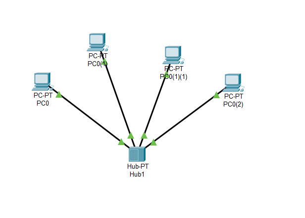
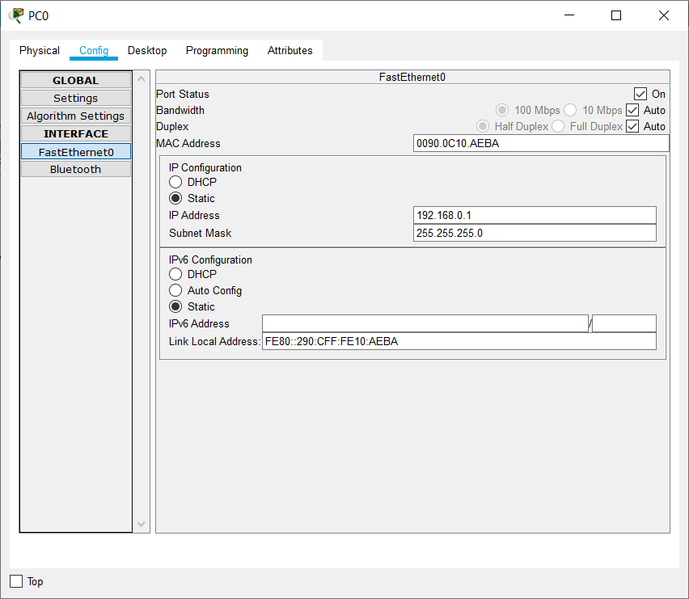
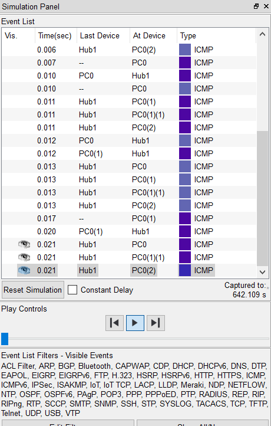
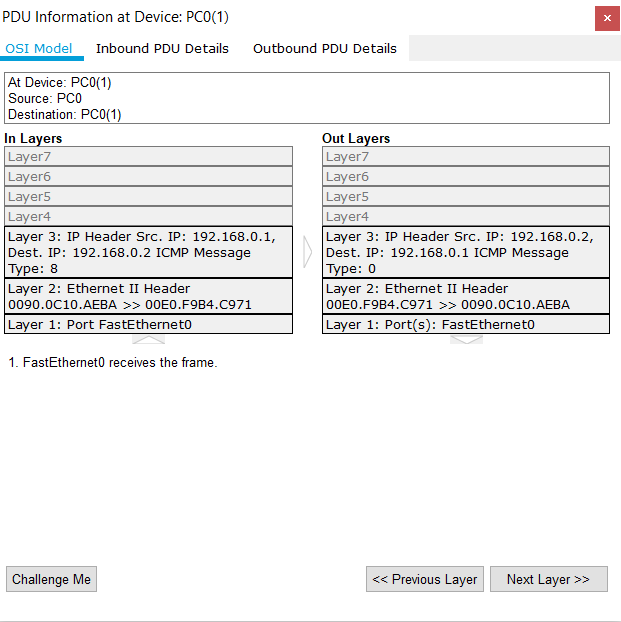
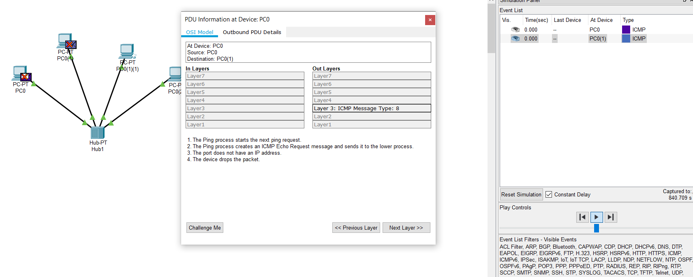
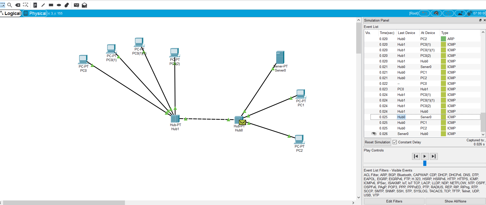
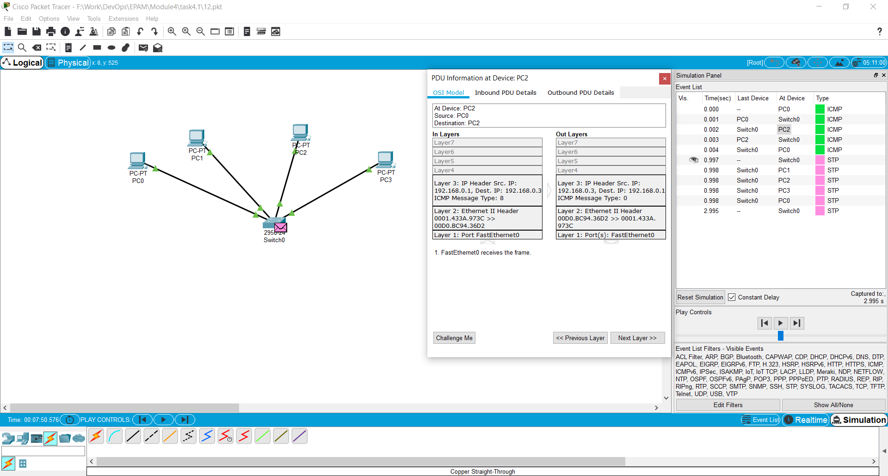
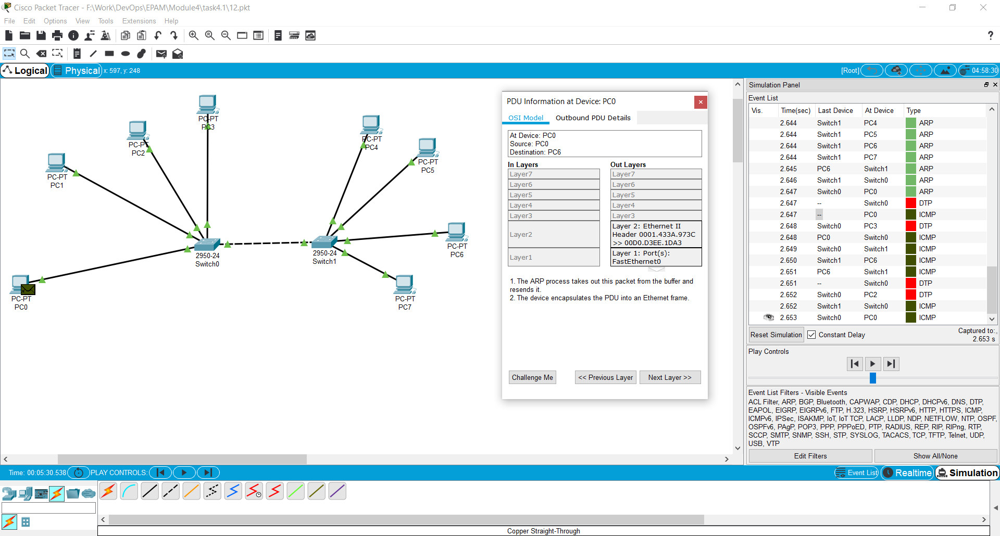
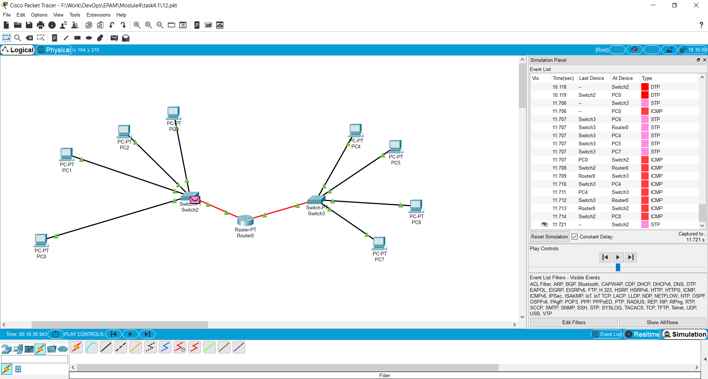

# Task 4.1
1. Creating the first project in Cisco Packet Tracer.  

2. Adding IPs and subnet mask to every host  
  
3. Checking network work by sending ICMP packages between hosts  
  
4. Analyzing host communication on OSI layers  
  
As we can see source hos communicates with destination host on Layer3/Network layer  
5. After I have removed IP addresses from hosts, no packages are delivered. Every device in a network should have its own IP address.  
  
6. Creating the next project  
  
7. Creating new project with **Switch** instead of **Hub**  
  
This scheme works differently as Switch does not send package to all hosts connected.  
Instead, it sends package to only required host.  
8. Expanding previous project by adding another switch with hosts  
  
9. Adding **Router** to our previous project.  
  
Having 192.168.0.0/24 and 192.168.1.0/24 means that we have 2 different networks.  
Router allows us to conenct several different networks or even divide one network into several subnets.  
