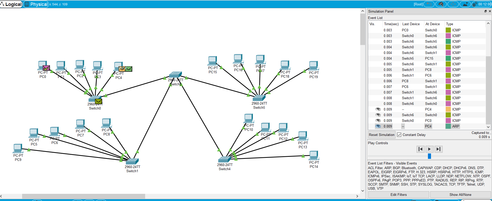
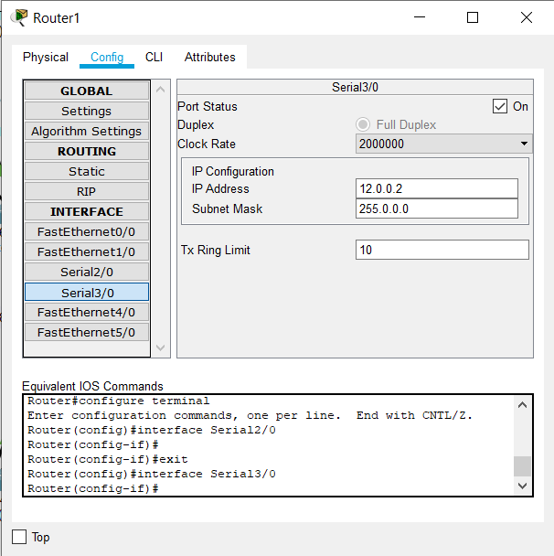
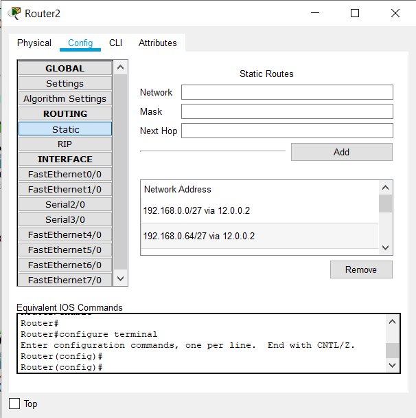
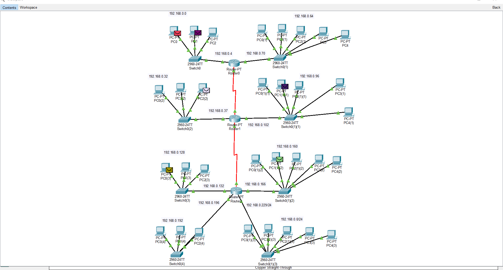
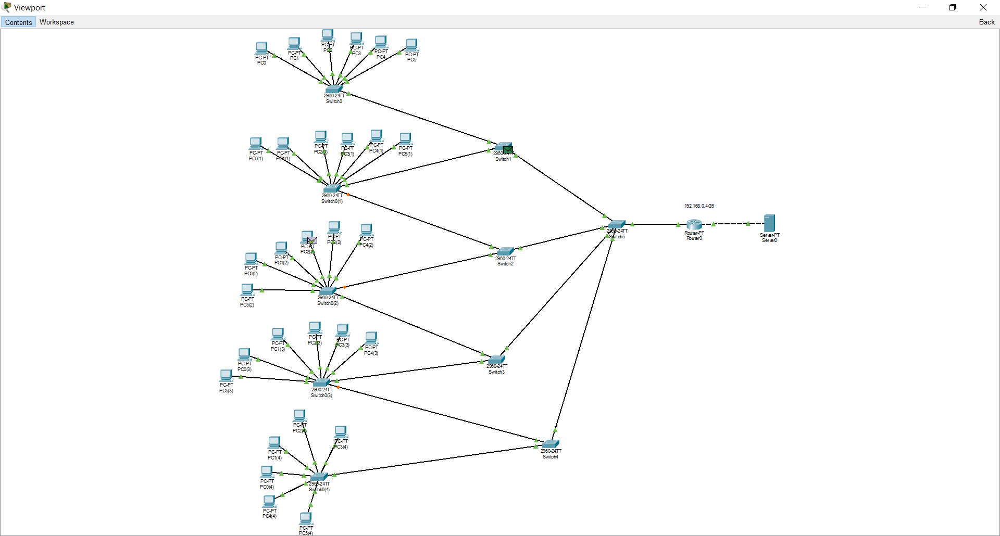

# Task 4.2
1. Creating corporate network which consist of 2 buildings with 2 floors in each.  
Each floor has working group with 5 PCs  
It was decided to use Swtich for a connection between floors. Next layer Swtich is used to connect 2 buildings with each other.  
ICMP packages are being sent smoothly as all PCs are located in the same network.  
  
2. Creating a network from 1 building which has 4 floors. Subsystem on each floor consists of 2 working groups (3 and 5 PCs). This network should be divided into 8 subnets.  
It was decided to use Routers in order  to divide a network.  I have created 3 routers which are connected with each other using Serial interfaces.  I have also created Static routing rules in order to connect all the networks between each other. 
  
  
  
In order to divide class C IP with a default mask */24* into subnets, we have to change our subnet mask.  
It was decided to use */27* subnet mask.   
The last network has */24* default mask as I have made a mistake in calculations and could only divide my network into only 7 networks. It was required to use */28* mask instead.  
3. Creating corporate network which consist of 5 buildings with 1 floor. Every floor has 1 working group with 6 PCs. It is also required to use a router with access to an external network (Internet)  
As we need to have about 32 hosts in our network, it was decided to use class C IP with /26 mask instead of the default one.  
  
In this project a **Server** with IP *8.8.8.8* (Google service) was used as an Internet access.  

