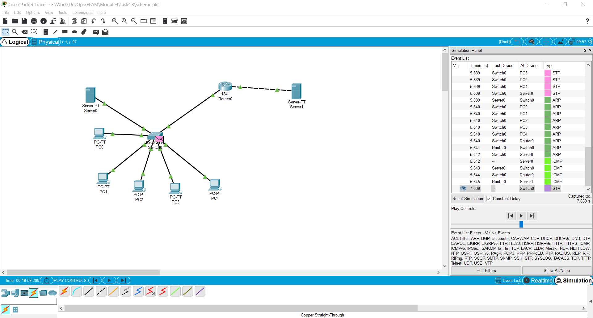
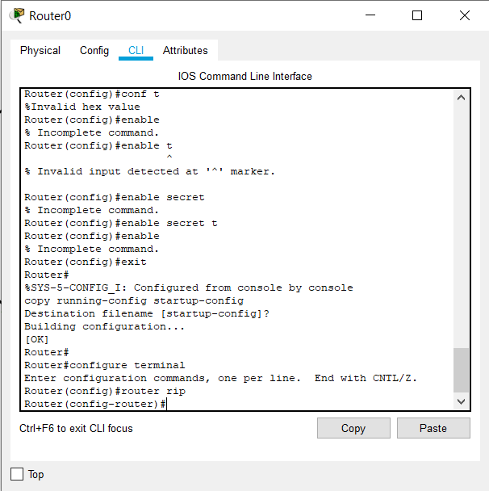
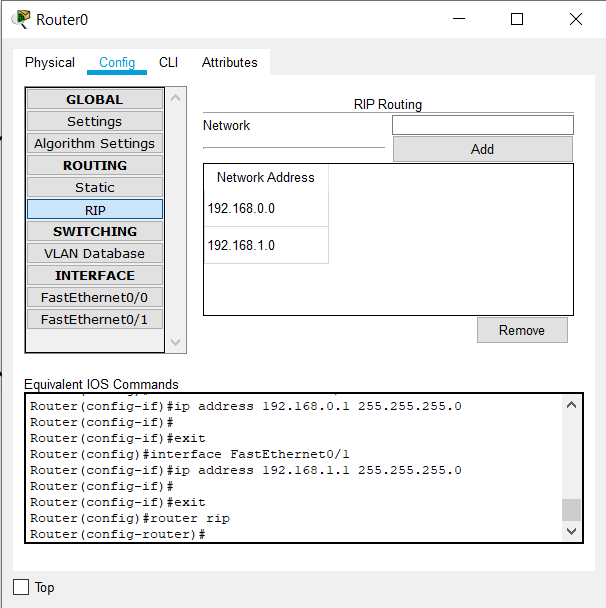

# Task 4.3
1. Creating network with 5 **PCs** and 1 **server**. We are using **Router** and another server in order to create new network and set up RIP routing.  
  
2. Enabling secret password for **Router** via CLI   
  
3. Setting RIP routing on **Router**  
  
Having **/24** mask (*255.255.255.0*) means that *192.168.0.0* and *192.168.1.0* are different networks.  
