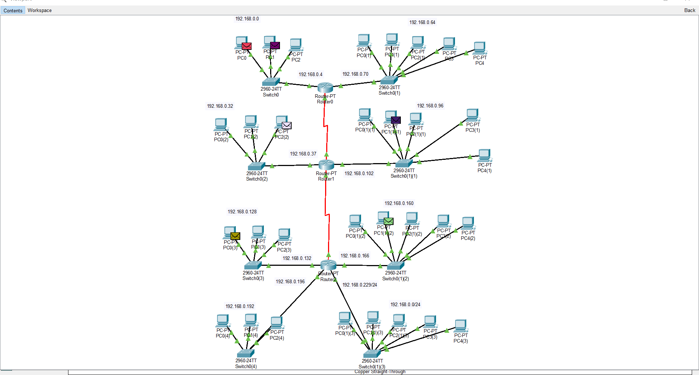
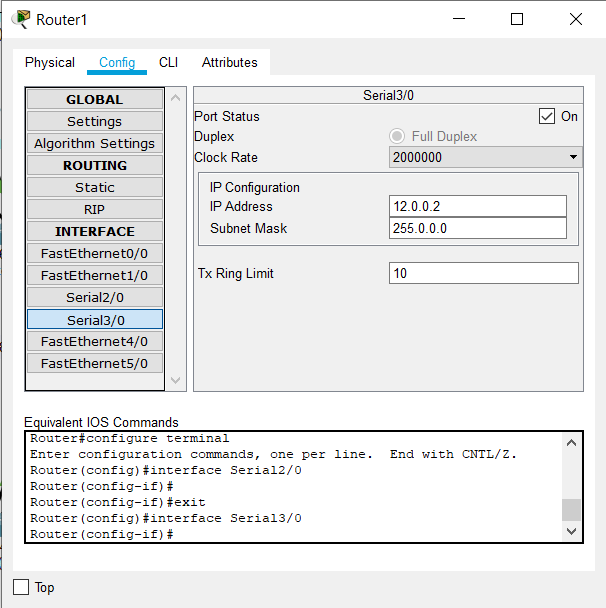
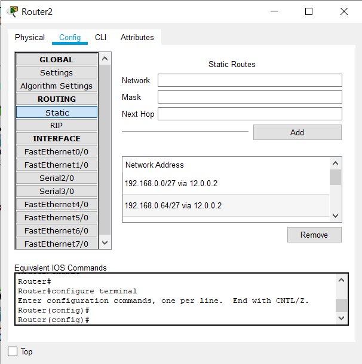
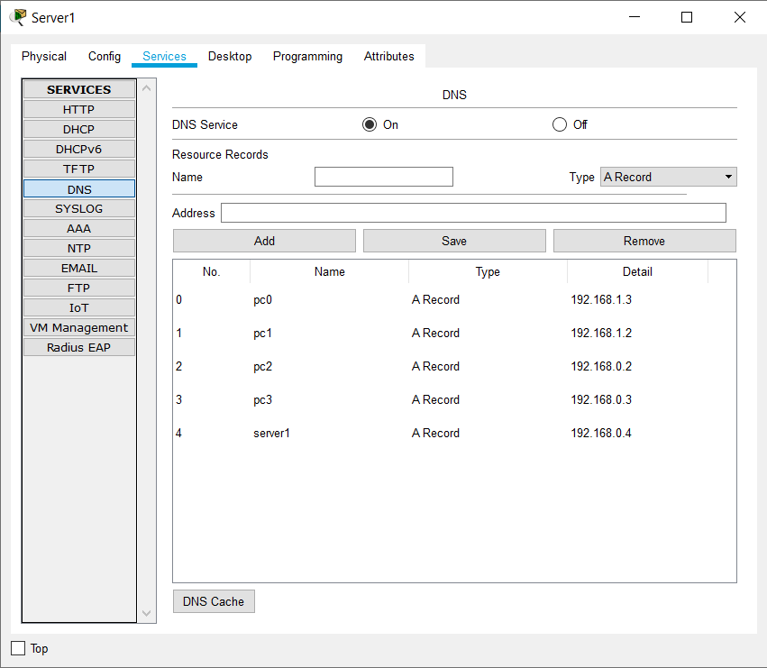
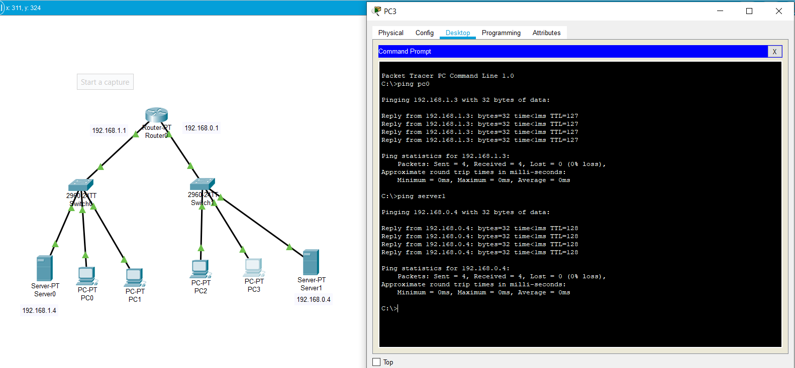

# Task 4.4
1. I have already used 3 Routers in order to create Static routing between networks connected to these routers.  
  
  
  
2. Creating 2 subnets with DNS server for each subnet  
  
It is also required to set address of a DNS server for every PC in network.  
  
As we can see, using ping hostname allows us to send ICMP package to required device. That means hostnames are connected with their IP addresses.  
