# Task 5.1  
## Part 1   
1. I have logged in as vlados user. Using `su -` in order to log in as root.  
This command will ask you to enter a password for root user.  
There is a workaround, you can use:  
`sudo su - `  
In this case, it will ask you for a vlados user password  
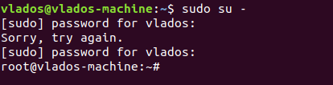  
`#` - at the end of my command promt means that I am a root user.  
`$` - means that I am regular user.  
 
2. Changes password using `passwd` command.  
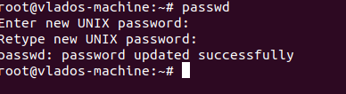  
It has changed */etc/shadow* file since this file contains hashed passwords for users.  
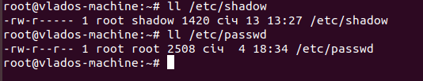  

3. Using `w` command to check logged users and commands they are running.  
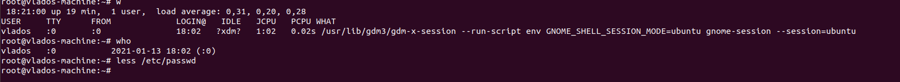  
We can also use `who` command to check current users.  
If we want to check all the registered users (pseudo-users also), we can check content of */etc/passwd* file  
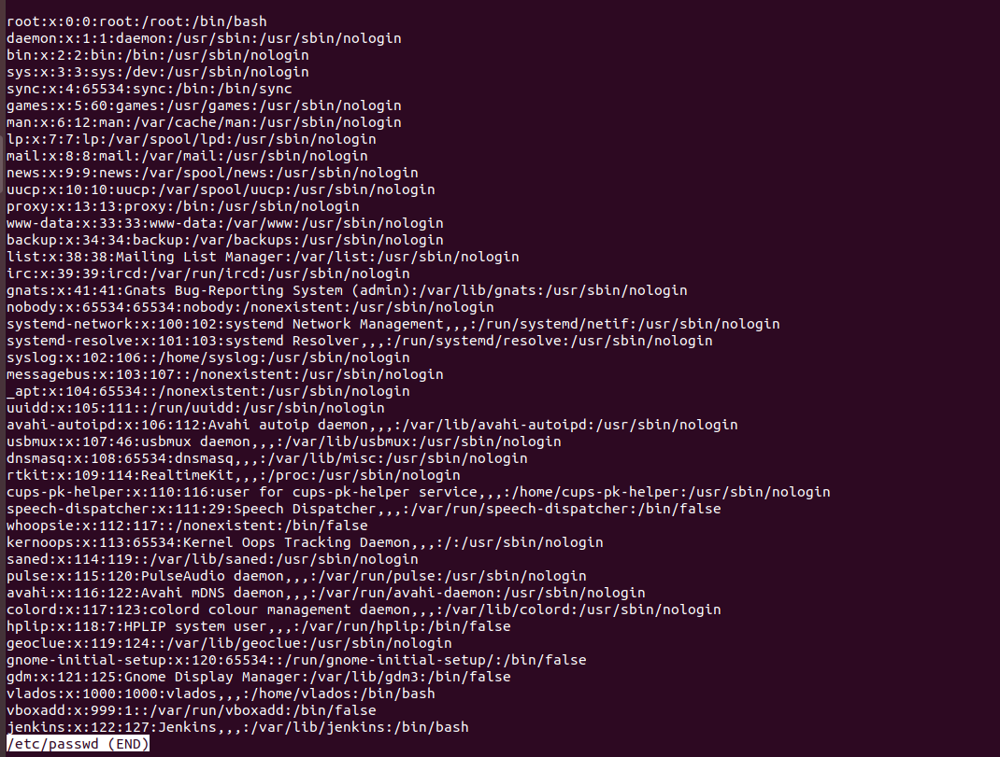  

4. Personal information is shown by using `finger` command.  
To change this information, we can use `chfn` command  
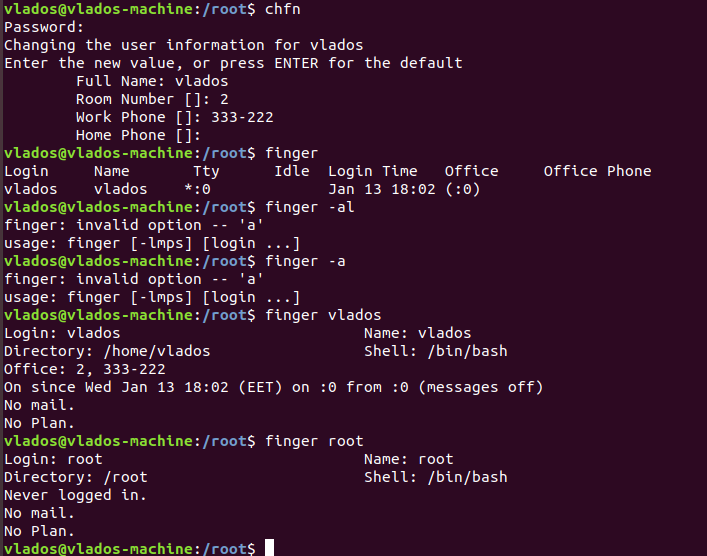   

5. Checking keys for used commands.  
For `passwd` command:  
`-S` - status.  
`-a` - all users.  
`su --shell /bin/sh` - Option is used to specify shell which will be used during user change.  
[!screen](./screenshots/su_options.png)  

6. Checking `less` and `more` commands.
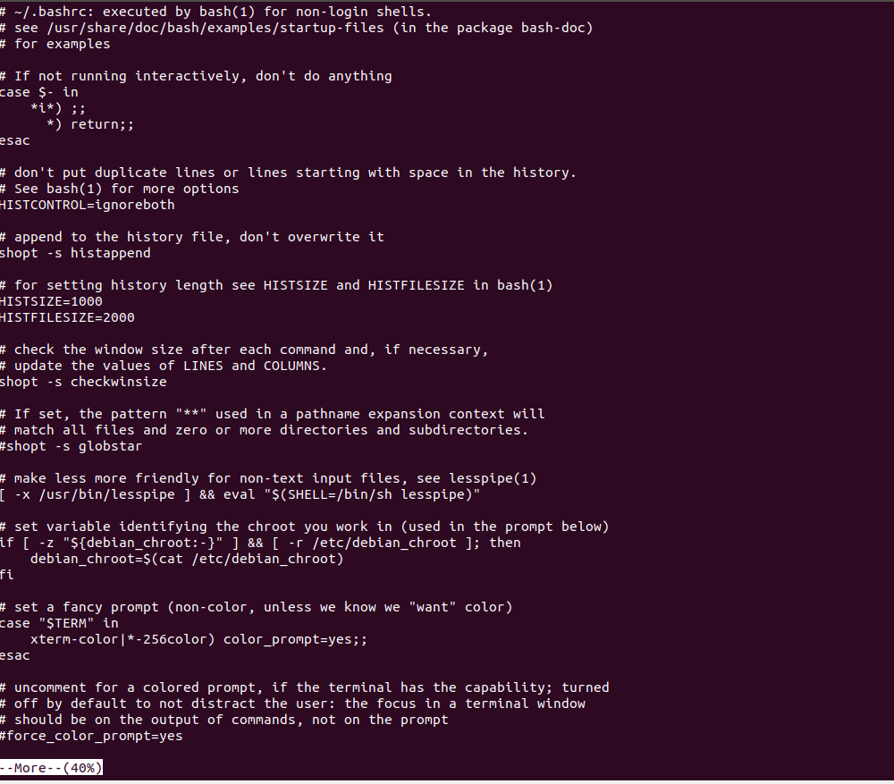  
`less` is more like `more` command. However, it has more functions.  
`less` has some features from `vim`. For example, you can use `/word` inside `less` in order to find *word* in file.  
`?word` is a backward search in `less`  
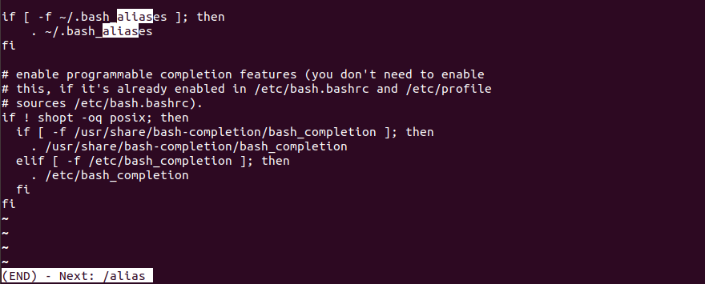  

7. We can create a file *.plan*. The content of this file will be shown in `finger` output.  
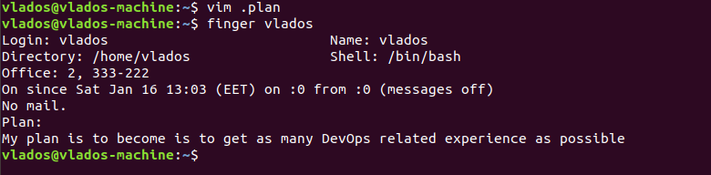  

##Part 2  
1. Using `tree` command to check content of fylesystem shown in a tree-like format.  
`-a` option will print all files (even hidden ones)  
`tree -P wildcard*` command ca help us to print files that match the pattern.  
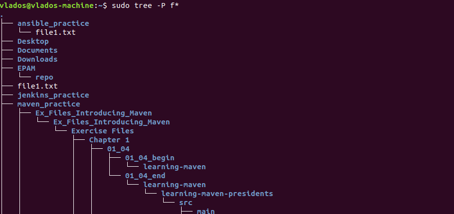  
It is possible to adjust depth of search using `-L` option.  
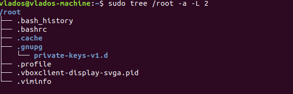  

2. The `file` command could be used in order to check the type of a file.  
<pre>vlados@vlados-machine:~$ file /bin/systemctl
/bin/systemctl: ELF 64-bit LSB shared object, x86-64, version 1 (SYSV), dynamically linked, interpreter /lib64/ld-linux-x86-64.so.2, for GNU/Linux 3.2.0, BuildID[sha1]=d01b5d7cadd9c3bf76be5e8e37422bab7e834ac4, stripped
vlados@vlados-machine:~$ file file1.txt 
file1.txt: ASCII text</pre>  
  
3. We can go back to home directory using:
`cd` command.
We can also specify location of homedir using enviromnent varible: *$HOME*
`cd $HOME`  
<pre>vlados@vlados-machine:~$ echo $HOME
/home/vlados</pre>  

Navigating the system using absolute and relative paths:  
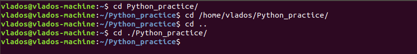

4. The `ls` command is used to list the content of current or specified directory.  
`ls -l` -show content of directory in list format 
`ls -a` -show all files/directories. Some files could be hidden, they have "." in front of their names.  
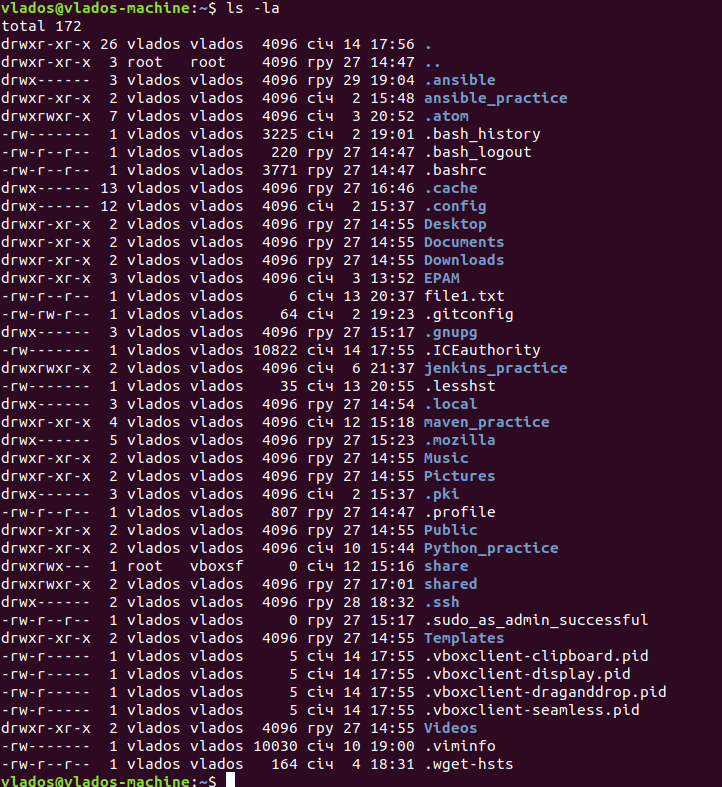  

5. Performing operation sequence:  
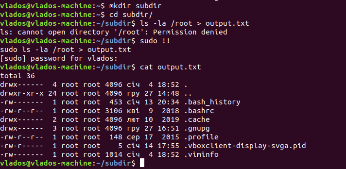  
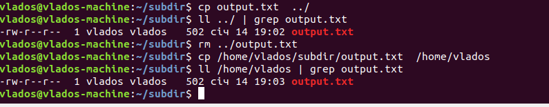  
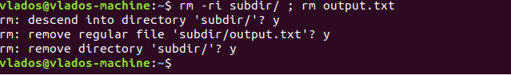  

6. Creating and managing hard and symlinks.  
We can see *l* bit for symlink.  
The **hard links** are basically copy of a file. So, we do not have a way to specify if this is a hard link.  
However, as hard link is pointed to the same **inode** the source file is, we can check if those files are using the same **inodes**.  
It can be done using `ls -lih` command.  
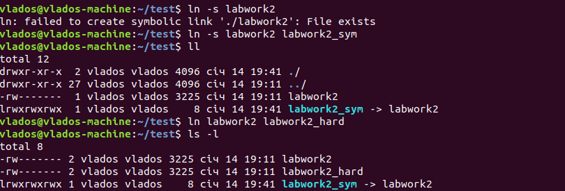  
When you make changes in symlink file, the source file is being changed also.  
In case source file for a symlink is removed, it will not be accessible via symlink.  
As for hard link file, it will still be accessible.  
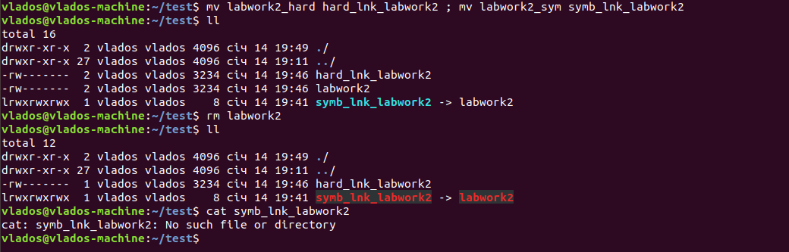  

7. Using `locate` utility.  
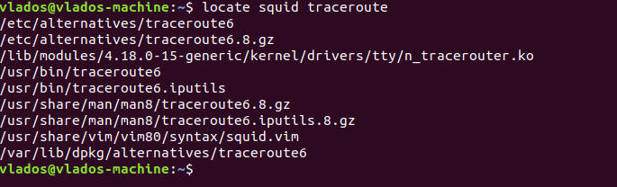  

8. Checking which partitions are mounted in the system.  
For that, we can use `mount -l` command.
However, more human-readable output will be shown while using `df -aTh` command.  
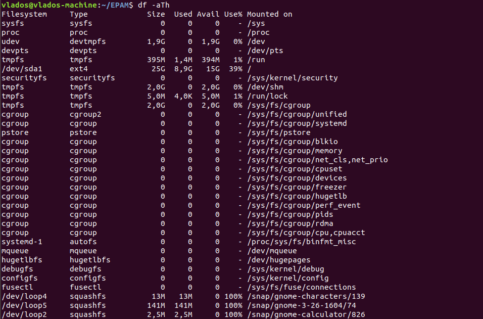  

9. Counting number of lines where some pattern in file is present.  
<pre>vlados@vlados-machine:~$ grep -c alias .bashrc
16</pre>  

10. Using `find` command we need to find all files in */etc* directory. These files should contain **host** sequence.  
<pre>sudo find /etc -type f -name *host*
/etc/ansible/hosts
/etc/X11/Xsession.d/35x11-common_xhost-local
/etc/X11/Xsession.d/60x11-common_localhost
/etc/hosts.deny
/etc/ImageMagick-6/type-ghostscript.xml
/etc/hosts.allow
/etc/host.conf
/etc/hosts
/etc/hostname
/etc/avahi/hosts
vlados@vlados-machine:~$ </pre>  

11. Listing all the objects in */etc* directory which contain **ss** character sequence in names.  
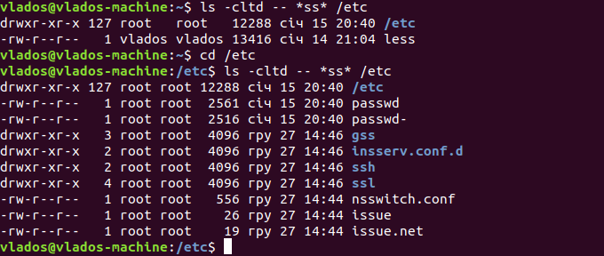  
We can get the same output using `grep` command.  The output from `ls` command may be directed to `grep` utility.  
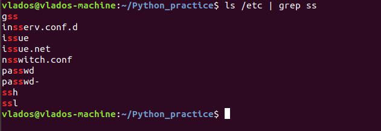  

12. The screen-by-screen print of the content in */etc* directory could be achieved by moving output from `ls` command into `less`  
<pre>vlados@vlados-machine:~$ ll /etc | less
vlados@vlados-machine:~$ ll /etc > listetc ; less listetc</pre>  

13. There are several device types present in Linux system.  
tty  
disk  
root  
knem  
cdrom  

We can check the device and type in several ways:  
Check the content of **/proc/mounts** file.  
Using `df` command.  
It is also possible to list objects located in **/dev** folder.  
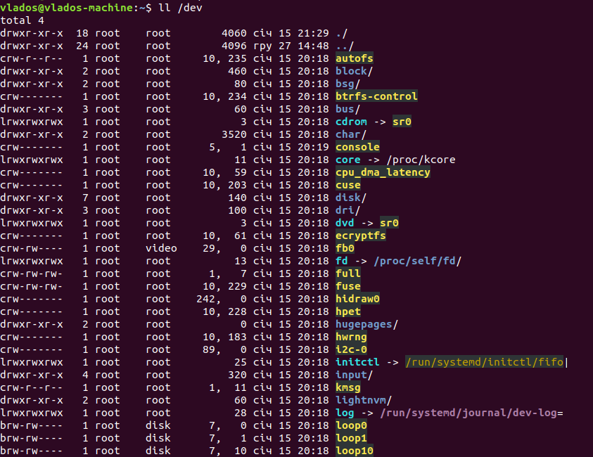  

14. There are several types of files in system.  
named pipes  
sockets  
symbolic links  
 We can check the type of a file using the following command:  
`ls` command with `-l` option -it will show required bit in case it is a simlink, or pipe or socket.  
 
15. Listing the first 5 directory files that were recently accessed in the **/etc** directory.  
<pre>sudo find /etc -type d -mtime -1
/etc
/etc/X11/Xsession.d
/etc/1
/etc/cups
/etc/6
/etc/5
/etc/3
/etc/2
/etc/xdg/autostart
/etc/4</pre>

In order to list only first 5 entries, we can use `head` command.  
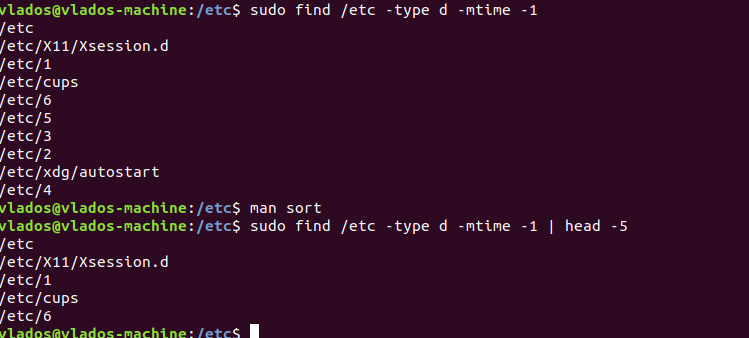
