# Task 5.2
1. Checking content of **etc/passwd** and **/etc/group** files.  

**/etc/passwd** file has information about users registered in system:   

`vlados:x:1000:1000:vlados,2,333-222,:/home/vlados:/bin/bash`  
This example line has the following definitions:  
<pre>username:password:UserID:Primary groupID:Comments(vlados,2,333-222).These were added using *finger* command:home directory:default shell</pre>  
**Pseudo-users** are like users which are used by the system for some tasks.  
They usually do not have the actual shell in **/etc/passwd** file.  
**Pseudo-users** can be:  
<pre>daemon - used by system processes 
bin - gives ownership of executable command
adm - regisration files
noobody - Used by many services
sshd - used by the secure shell server</pre>   

Example:  
<pre>daemon:x:1:1:daemon:/usr/sbin:/usr/sbin/nologin 
sync:x:4:65534:sync:/bin:/bin/sync
nobody:x:65534:65534:nobody:/nonexistent:/usr/sbin/nologin
speech-dispatcher:x:111:29:Speech Dispatcher,,,:/var/run/speech-dispatcher:/bin/false</pre>

**/etc/group** file has information about current groups used in the system.  
Example of **/etc/group** content:  
`sudo:x:27:vlados`
<pre>GroupName:password:GroupID:Group members</pre>  

2. **UID** is an ID of a user - unique number which represents user in the system.  
We can define it in **/etc/passwd** file   
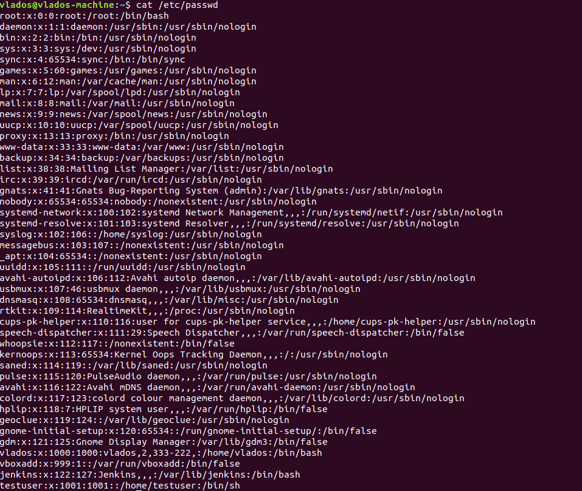  
It is also possible to use `id` command in order to check ID info of a current user:  
<pre>vlados@vlados-machine:~$ id
uid=1000(vlados) gid=1000(vlados) groups=1000(vlados),4(adm),24(cdrom),27(sudo),30(dip),46(plugdev),116(lpadmin),126(sambashare),999(vboxsf)
vlados@vlados-machine:~$</pre>  
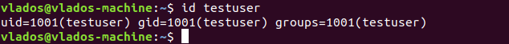  

The user ID has following ranges:  
**0 - 65535** - Overal ID ranges.  
**1 - 999** - These IDs are reserved for system users.  
IDs for  regular users start from **1000**.  

3. **GUID** is a unique identifier of a group in Linux system.  
It can be checked in **/etc/groups** file.  
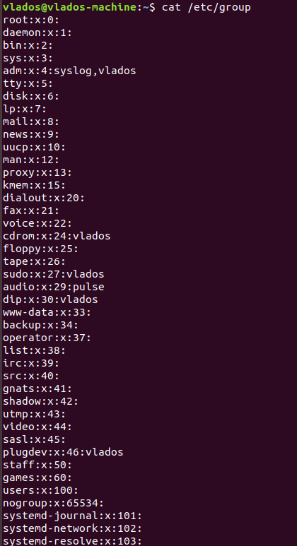    
Alternatively, we can use `getent group` command in order to list all the created groups.  
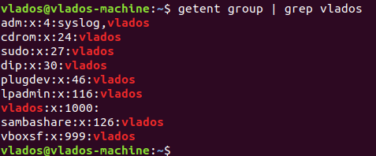  

4. We can use `id user` command in order to check if some user belongs to any group.  
It can also be checked in **/etc/groups** file.  

5. In order to create a new user, it is possible to use `useradd` or `adduser` commands.  
It is required to note that `useradd` only adds user to the system without password creation. It will not be possibe to login as that user until you create password for user.  
<pre>vlados@vlados-machine:~$ sudo useradd mike
vlados@vlados-machine:~$ sudo cat /etc/shadow | grep mike
mike:!:18645:0:99999:7:::
vlados@vlados-machine:~$</pre>  
`adduser` is more commonly used command.  
Every user needs to have a password.  

6. If we want to change account name for a specific user, the command `usermod -l new_name` should be used.  
Mail spool and homedir of that user will not be changes. It will be rquired to update it manually.  

7. skell_dir is a directory which defines which files should be present in home directory during creation of a new user.  This directory contains files that will be copied.  
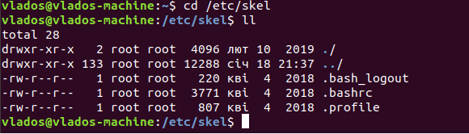  

8. We have 2 commands to remove users from a system:  
`userdel` is used to delete user with all entires. This means it will delete every file/folder associated with this user. Mailbox will also be deleted in this case.  
`deluser` is used to delete user from a system without removing home directory or mail spool.  We can use `deluser --remove-home` option in order to remove home directory and mail spool.  

9. In order to lock a user, it is possible to use `usermod -L` command. This command will disable user's password which will make user account inactive.  
It will put **!** sign instead of a password in **/etc/passwd** file.  
To unlock user, the command `usermod -U` should be used.  
In addition, we can use `passwd -l` command in order to lock our user. `passwd -u` will unlock the user.  

10. It is possible to create a password-free login option for a user using `passwd -d` command.  
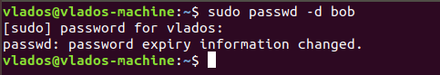  
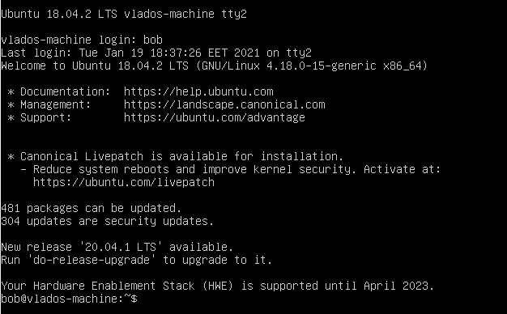  

11. Extended information about specific directory can be obtained with `ls -ld` command.  
<pre>vlados@vlados-machine:~$ ls -ld /home
drwxr-xr-x 4 root root 4096 січ 19 18:36 /home
vlados@vlados-machine:~$</pre>  

The output has the following parts:  
**drwxr-xr-x** - permissions;   
**root** - owner;  
**root** - owner group;  
**4** - number of hard links created for this directory;   
**4096** - size of a folder. It may *not* be the actual size of the files inside that folder.  
**січ 19 18:36** - date when something was changed inside a folder.  

12. **Access rights** are shown as 10 symbols  
The **first** symbol describes type of a file(d - directory, l- symlink, - -file)  
The next **3** symbols are access rights for **owner** of an object. The other **3** symbols are access rights for owner group.  
The last **3** symbols represent access rights for others.   
Those symbols can be:   
**r** - means read information from an object;   
**w** - write infromation to the object;   
**x** - execute object.  
There is also such thing as **SUID** and **SGUID** bits. These bits are used to define that file is executed with the same permissions as the file owner.  
This bit is show as **s** or **S** instead of **x** permission in **owner** prmissions.  
If **S** is set, it means that there was no **x** bit set for that file before.  
**SGUID** bit is represented by the same **s** or **S** bits. However, this bit is present instead of **x** bit
where **group owner** permissions are defined.  
 

13. In order to check what could be done with an object in filesyste, we can use `ls -l` command.  
It will show permission bits for user who owns the file, for group of the owner, and for other users.  
It is also possible to list file attributes using `lsattr`. Attributes will also help us to define which actions could be done with this specific object.  

14. The `chown` command is used in order to change ownersip of a file.  
We can define new user and group to own the file or directory.  
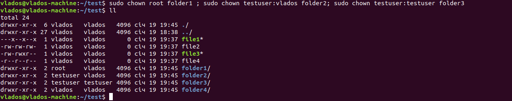  
The access mode is usually changed by `chmod` command.  
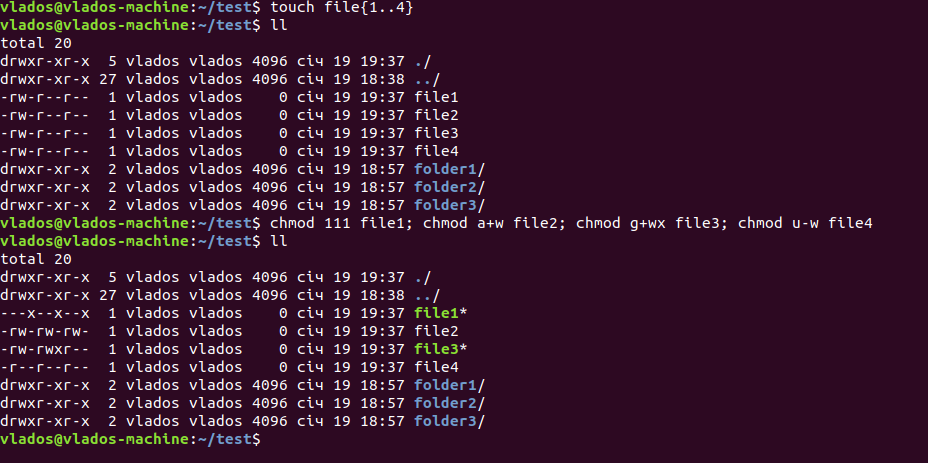  

15. `umask` command is used to set default permissions for every new created object in Linux.   
Every permission bit has its octal representation:   
r - 4
w - 2
x - 1 
Combination of them creates permissions like *744 - (r+w+x,r,r)*  
*250 - (w,r+x,-)*  

16. Sticky bit is used to protect folder from deletion. It also protects content of that folder from delition.  
With sticky bit only **owner** of a folder and **root** can delete it. It could be set with `chmod t folder` 
or `chmod 1xxx folder` commands. Where `xxx` are octal permissions.  
The **/tmp** folder has a sticky bit. This folder contains temporary objects which are created by other users.  
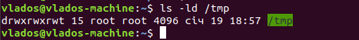  
 
17. If we want to run a script, it should be executable and readable for user who will run it.  
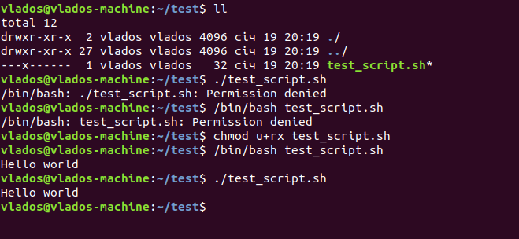  

