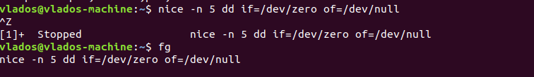
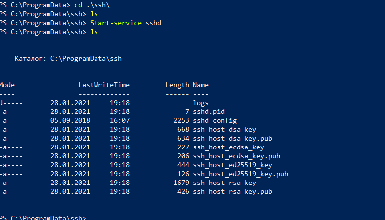
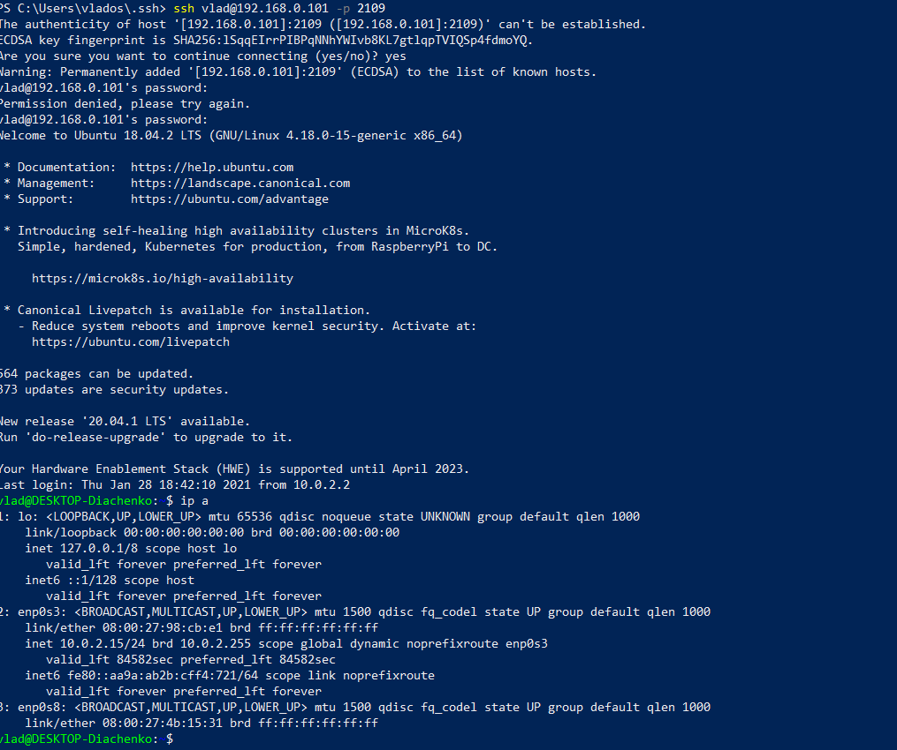

# Task 5.3
## Part 1
1. In Linux systems processes can have the following states:  
Created  
Ready  
Running  
Terminated  
Waiting  

2. **pstree** is a command that used in order to show all current processes in a tree-like format.  
It begins with **systemd/init** process which runs every other processes.  
  
**-T** option was used in order to hide process threads and show only processes themselves.  

3. **/proc** is a pseudo-filesystem which shows kernel-related information.  
It is used in order to check and adjust kernel parameters **(proc/sys)**  
You can see folders created for each *PID* which us running in the system.  

4. Information about CPU can be checked in **/proc/cpuinfo** file  
  
Another way is to use the following command:  
<pre>vlados@vlados-machine:/proc$ sudo lscpu
Architecture:        x86_64
CPU op-mode(s):      32-bit, 64-bit
Byte Order:          Little Endian
CPU(s):              1
On-line CPU(s) list: 0
Thread(s) per core:  1
Core(s) per socket:  1
Socket(s):           1
NUMA node(s):        1
Vendor ID:           GenuineIntel
CPU family:          6
Model:               158
Model name:          Intel(R) Core(TM) i7-8750H CPU @ 2.20GHz
Stepping:            10
CPU MHz:             2208.002
BogoMIPS:            4416.00
Hypervisor vendor:   KVM
Virtualization type: full
L1d cache:           32K
L1i cache:           32K
L2 cache:            256K
L3 cache:            9216K
NUMA node0 CPU(s):   0
Flags:               fpu vme de pse tsc msr pae mce cx8 apic sep mtrr pge mca cmov pat pse36 clflush mmx fxsr sse sse2 ht syscall nx rdtscp lm constant_tsc rep_good nopl xtopology nonstop_tsc cpuid tsc_known_freq pni pclmulqdq monitor ssse3 cx16 pcid sse4_1 sse4_2 x2apic movbe popcnt aes xsave avx rdrand hypervisor lahf_lm abm 3dnowprefetch invpcid_single pti fsgsbase avx2 invpcid rdseed clflushopt flush_l1d
vlados@vlados-machine:/proc$</pre>  

5. Checking all the required information using **ps** command.  
  

6. Kernel processes are shown in [] brackets.  
You cannot manage them.  
  
Kernel processes are child processes of **kthreadd** - it has PID 2  
So we can check child processes of kthreadd using `sudo ps --ppid=2 --pid2` (to show **kthreadd*8 itself)  
  

7. `ps aux` to list processes   
**State** is defined by **STAT** column
`vlados    2078  0.0  0.0  45984  3648 pts/0    R+   21:27   0:00 ps aux`
R - running or runnable   
+ - in a foreground process group   
S - Interuptable Sleeping. Waiting for an event to complete  
s - session leader.   
T - stopped   
Z - zombie. Process is terminated. But his parrent could not remove it.  
D - Uinteruptable sleep. The process cannot be stopped. Waiting for I/O operation
There are also some process modificators  

8. Displaying only processes for a specific user.  
  
  
  

14. Managing priority using **nice/renice** commands.  
**nice** - to start process with a specific priority  
**renice** - to change priority of the process which is already running  
These commands have paremeters from -20 to 19.  
Priority is shown in numbers from 0 to 39. 
  
  
  
  

15. **r** key is used to change priority in **top** uility.  
  
  

16. **kill** command is used to send signals to a process.  
There are several signals to use. Each signal has its own way of changing the process.  
We can check all the signals using `kill -L`

<pre>vlados@vlados-machine:~$ kill -l
 1) SIGHUP	 2) SIGINT	 3) SIGQUIT	 4) SIGILL	 5) SIGTRAP
 6) SIGABRT	 7) SIGBUS	 8) SIGFPE	 9) SIGKILL	10) SIGUSR1
11) SIGSEGV	12) SIGUSR2	13) SIGPIPE	14) SIGALRM	15) SIGTERM
16) SIGSTKFLT	17) SIGCHLD	18) SIGCONT	19) SIGSTOP	20) SIGTSTP
21) SIGTTIN	22) SIGTTOU	23) SIGURG	24) SIGXCPU	25) SIGXFSZ
26) SIGVTALRM	27) SIGPROF	28) SIGWINCH	29) SIGIO	30) SIGPWR
31) SIGSYS	34) SIGRTMIN	35) SIGRTMIN+1	36) SIGRTMIN+2	37) SIGRTMIN+3
38) SIGRTMIN+4	39) SIGRTMIN+5	40) SIGRTMIN+6	41) SIGRTMIN+7	42) SIGRTMIN+8
43) SIGRTMIN+9	44) SIGRTMIN+10	45) SIGRTMIN+11	46) SIGRTMIN+12	47) SIGRTMIN+13
48) SIGRTMIN+14	49) SIGRTMIN+15	50) SIGRTMAX-14	51) SIGRTMAX-13	52) SIGRTMAX-12
53) SIGRTMAX-11	54) SIGRTMAX-10	55) SIGRTMAX-9	56) SIGRTMAX-8	57) SIGRTMAX-7
58) SIGRTMAX-6	59) SIGRTMAX-5	60) SIGRTMAX-4	61) SIGRTMAX-3	62) SIGRTMAX-2
63) SIGRTMAX-1	64) SIGRTMAX</pre>	

Common signals are **SIGTERM (15)** - which will gracefully kill process.  
**SIGKILL (9)** - which kills process in a "hard way" - it can damage the system as signal will not save its configuration.   

By default **kill** sends **SIGTERM** signal to a process.

And it throws us out of a terminal as this process was a child process for the one that was closed.  

`kill SIGTERM -1` result is shown on a screenshot 
If **PID = -1** - it will kill all the processes except the init process    
    

There is also a **SIGHUP (1)** process which will stop process in order for it to re-check its configuration.  
Example with **apache2** service.
Like no need to restart it, just use kill -1
If we change its configuration in **/etc/apache2/apache2.conf** file, it will be required to restart the service in order to apply new configuration.  
  
But we can send **SIGHUP** singnal in order to make apache2 service reload its configuration.  
  
  
  

17. **fb** - move a job to foreground.   
**bg** - move a job to a background.   
  
  
**sleep** - pause the job for a specific amount of time.  
<pre>vlados@vlados-machine:~$ date ; sleep 10s ; date
вівторок, 26 січня 2021 21:19:34 +0200
вівторок, 26 січня 2021 21:19:44 +0200
vlados@vlados-machine:~$</pre>  
  

## Part 2  
1. We can install OpenSSH server on Windows in order to use it with PowerShell.  
SSH client for Windows also has an option to generate SSH keys.  
 
   
We can use **ssh** command t connect to a remote host via SSH protocol.    
  
On the screenshot above the IPs look invalid as there was a port-forwardning set before.  
I have imported public key to guest machine manually.  
  
**scp** option that allows to copy a file between hosts using SSH.  
  

2. 
Basic ssh settings for increasing security:  
Change the port  
Change allowed user  
Disable root login.  
We can also disable password authentication.  
All these changes are done in **/etc/ssh/sshd_config** file.  
  
  

We should not forget to restart sshd service   
<pre>vlados@vlados-machine:/etc/ssh$ sudo service sshd restart
vlados@vlados-machine:/etc/ssh$</pre>  
 
3. There are several encyption types which can be used while you are generating a SSH key pair.  
<pre>dsa | ecdsa | ed25519 | rsa</pre>  
`ssh-keygen -t ecdsa -b 512` - generate key using ecdsa encryption and setting its size for 512 bytes.  
 **-p** option is used to change passphrase - used to change passphrase for a key_file.   
It will ask me to enter this passphrase when I want to access machine using ssh key  
  
**-N** is to define new passphrase. And **-f** option is used to select a key file to change passphrase for.  
**-f** option can be used to specify the name of a keyfile.  
  

4. Setting up port forwarding from the host machine to guet virtual machine.  
This option shows enabling port-forwarding using default VirtualBox settings instead of IPtables.   
IPtables option will be tested later.  
  
  

5. Using **tcpdump** to intercept traffic on interface comming via 22 port.  
Traffic was analyzed with **Wireshark**  
  
  
The main thing is that SSH sends encrypted packets, so there is no way to get username or password by anaylizng those packets. Of course, there are some *hacking-like* methods that could be used to get those credentials.  
Example of gathering packets comming via HTTP.  
  
