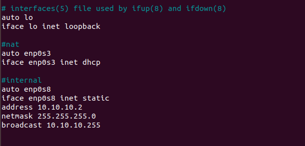

# Task 6.1
1. Creating infrastructure with 2 VMs and Host.  
VM1 has NAT and Internal network.  
  
VM2 has only internal network.  
  
2. Allowing to use forward of IPv4 packets in **/etc/sysctl.conf** file.  
  
Creating rules in **iptables** on VM1.  
  
In order to have rules in iptables saved after the reboot, it is required to install **iptables-persistance** package.  
After that, you will be able to save configuration in **/etc/iptables/rules.v4** file.  
  
3. Checking routes for VM2.  
  
4. Checking access to Internet for VM2 by pinging **8.8.8.8**  
  
5. Checking which resource is used with IP address **8.8.8.8**  
  
This will work only on VM1 or Host as VM2 has no DNS resolver or hosts file with these values.  
6. Checking IP which belongs to **epam.com**  
  
7. Determing default gateway for my Host.  
  
  
Routes for my Host machine  
  
8. Checking traceroute to google.com  
  
