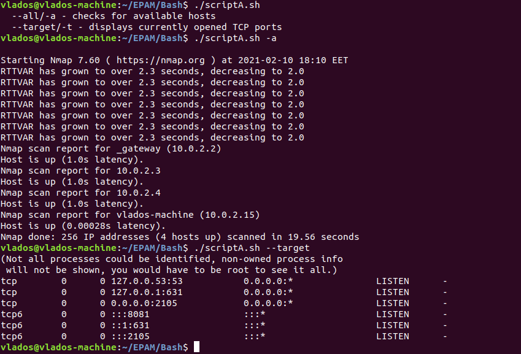
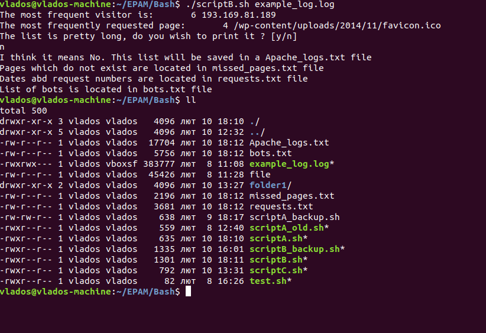
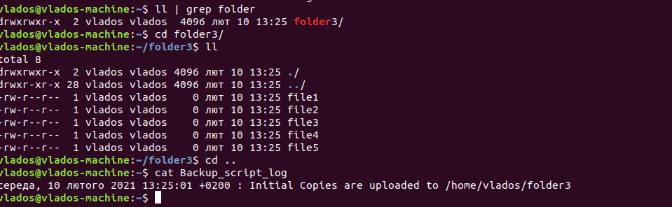
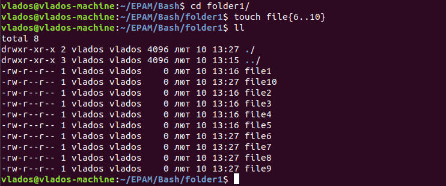
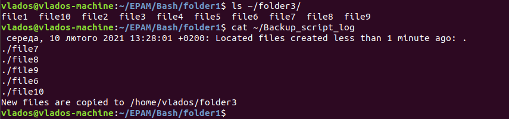
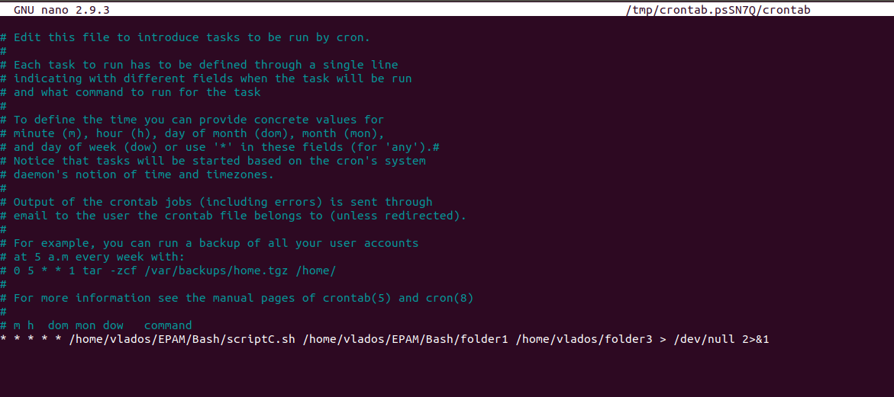

# Task 7.1
1. Creating script that uses options **--all** and **--target**. **--all** is used in order to display IP addresses and hostnames in network. **--target** should check for opened TCP ports on localhost.  
The script itself is located here: [scriptA](./scriptA.sh)  
  

2. Creating a script to look through apache logs and parse a text.  
The script file: [scriptB](./scriptB.sh)  
  
It was decided to make the script redirect large output to the specified files.  
Nevertheless, it asks to answer "y" or "n" to decide if one large list should be printed.  

3. Creating a script that backups data and generates logs regarding data manipulation.  
The script checks if destination folder exists. If no, the initial backup will be created. All the content of source folder will be copied to a destination folder during this initial backup.  
After that, the script will be checking for content that was created/changed in less than a minute.  
Such content will be copied into the destination folder.  
  
  
  
One minute period was selected due to the same period is set for cron.  
  

The script can be checked here: [scriptB](./scriptC.sh)
