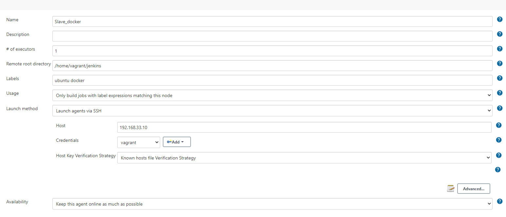
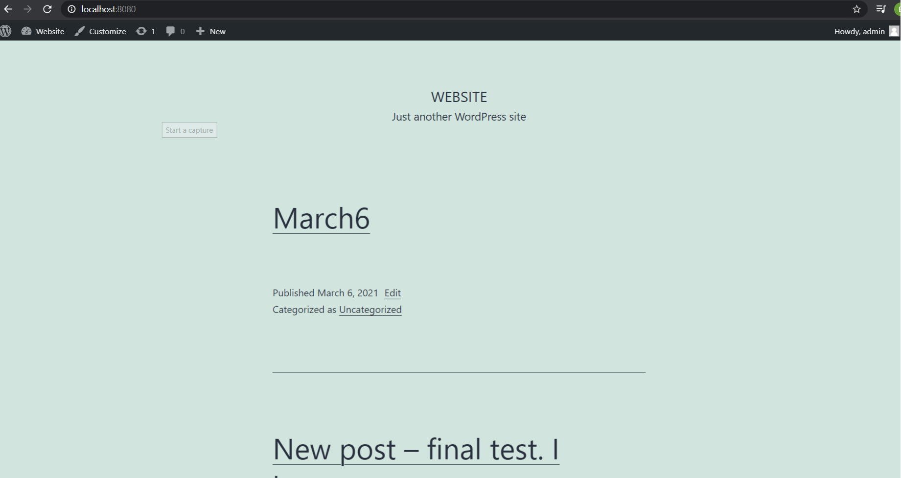
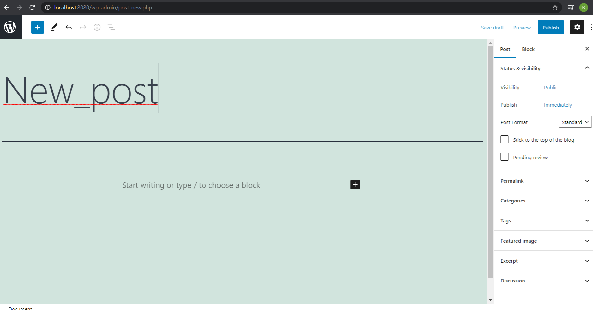
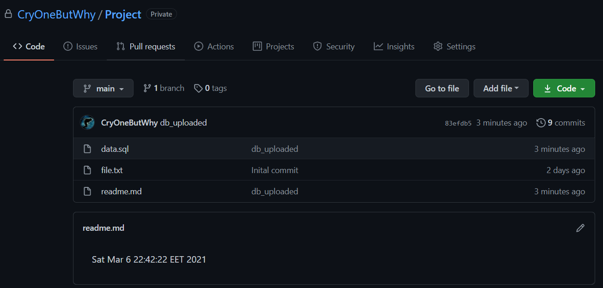
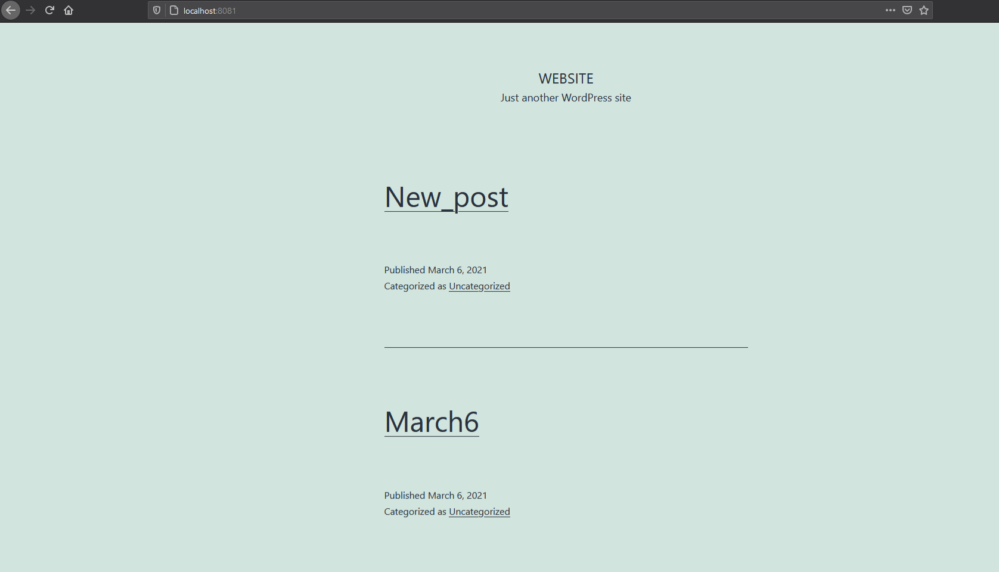

#Task 8.1 
1. It was decided to create 2 Docker containers using **Docker compose** in order to run **WordPress** with **MySQL** instances.  
So, basically we have 2 WordPress instances running on different ports (8080 and 80801)  
One instance is used to manage content for Wordpress website. Another instance is just copying current state of the previous WordPress instance.  
Jenkins is running builds on agent which is located on another virtual host.  
  

  
2. We are creating post on WordPress running on 8080 port.  
  
After we are ready to make our changes appear on *production* instance, we are running our **build** which creates database dump file and commits it to a private **GitHub** repository.  
The following pipeline was used:  
<pre>pipeline {
    agent {label 'docker'}
    environment {
        db_pass = credentials('slave_database')
    }
    stages {
        stage('Bb_backup_git') {
            steps {
                sh 'sudo docker exec -i  wordpress_blue_db_1 mysqldump -u root -p$db_pass wordpress > /home/vagrant/repo/data.sql'
                sh "TZ=':Europe/Athens' date > /home/vagrant/repo/readme.md"
                sh '/bin/bash /home/vagrant/git_script.sh'
                sh 'echo Database is backed up'
                
            }
        }
        
        }
        
    }

</pre>
The changes are uploaded to GitHub.  
  
3. After changes are made to a repository, second build downloads the database, changes links using **sed** utility in order to change port for WordPress website. After that, it imorts database to our production instance.  
<pre>
pipeline {
    agent {label 'docker'}
    environment {
        db_pass = credentials('slave_database')
    }
    stages {
        stage('Git_pull'){
            steps{
                script{
                    git branch: 'main',
                credentialsId: 'git_key',
                url: 'git@github.com:CryOneButWhy/Project.git'
                }
                
            }
                
            }
        
        stage('Links change') {
            steps{
                sh "sed -in 's/localhost:8080/localhost:8081/g' data.sql"
                sh "echo the links are changed"
            }
        }
        stage('Bd_upload'){
            steps{
                sh 'sudo docker exec -i  wordpress_green_db_1 mysql -u root -p$db_pass wordpress < data.sql'
                sh 'echo Database is moved to green'
            }
        }
    }
}
</pre>  
We see that new post appears on production instance.  
  