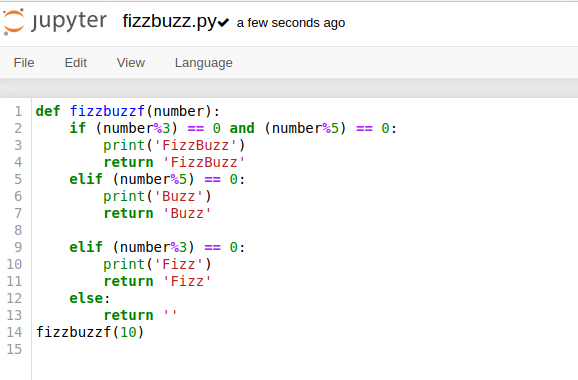
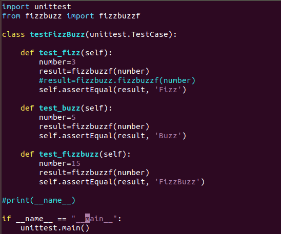
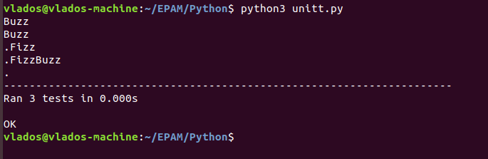
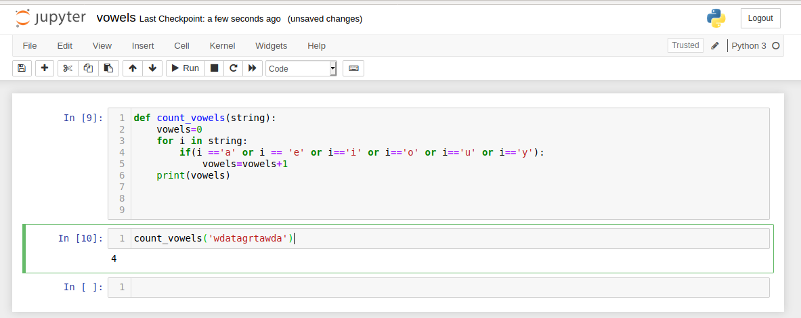
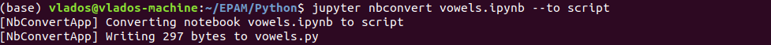

# Task 9.1
1. Creating a fizzbuzz function.  
  
  

The function itself: [fizzbuzz.py](./fizzbuzz.py)  
1.1 Creating a unit test for our fizzbuzz function.  
  
It was decided to just import function itself instead of the whole module.  
Running test:
  

The test itself: [unitt.py](./unitt.py)  
2. Creating a function which counts vowels in the specified string.  
  
It may be required to convert default jupyter notebook into a .py file.  
  

The function itself: [vowels.py](./vowels.py)  