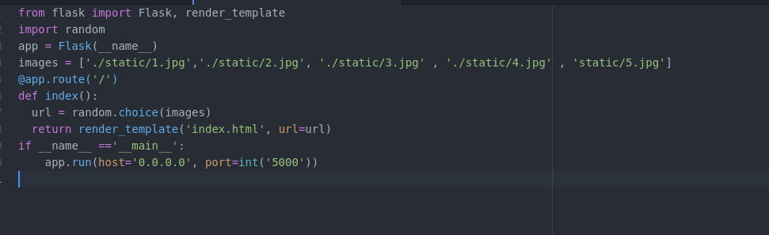
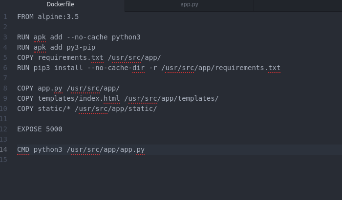
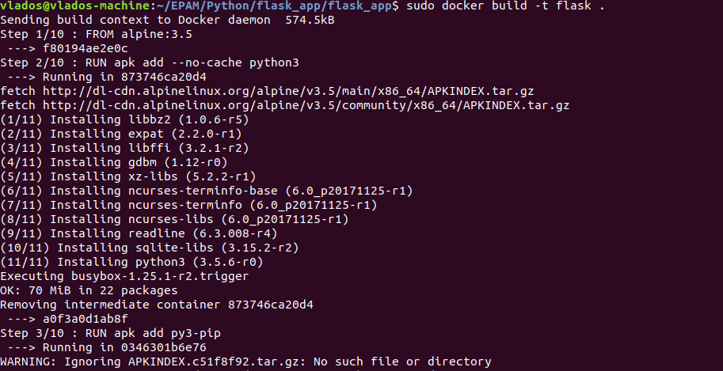
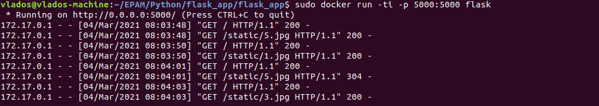
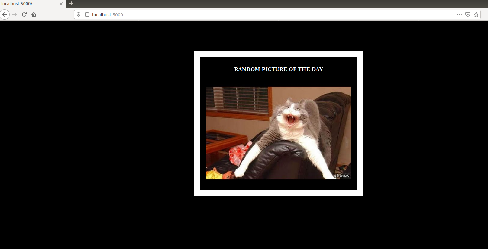

## Task 9.3 
Creating a web application which shows random picture every page reload. The pictures are taken from the local storage in order to be sure they are always present.
Python code part:    
  
We will be running it in a container created from the image bases on the following **Dockerfile**:  
  
Building image:  
  
Running docker container and forwarding ports:  
  
Checkig the application:  
  
Application files:  
[app.py](./flask_app/app.py)  
[index.html](./flask_app/templates/index.html)  
[Dockerfile](./flask_app/Dockerfile)  
